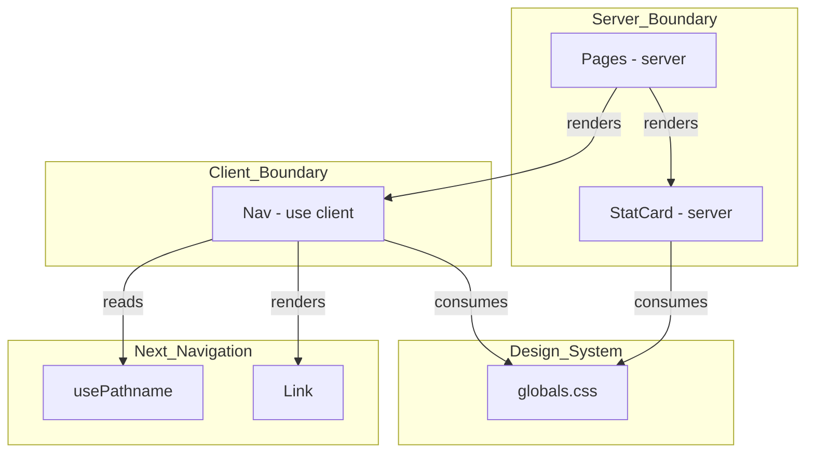

# Technical Design: base-components

## Overview

Este spec implementa os dois primitivos de UI compartilhados por todas as páginas do travel companion app: `Nav` (navegação responsiva top/bottom) e `StatCard` (card de estatística glassmorphism). Ambos já existem como stubs compiláveis em `src/components/`; este design define os contratos de interface, estilos e boundaries definitivos.

**Users**: Os dois viajantes acessam o app em mobile e desktop. O `Nav` é a estrutura de orientação em todas as 4 páginas; o `StatCard` é o bloco visual de destaque na Home.

**Impact**: `Nav.tsx` e `StatCard.tsx` serão completamente substituídos; `globals.css` receberá 4 novas variáveis semânticas necessárias para os componentes.

### Goals
- `Nav` renderiza top nav (desktop) e bottom tab bar (mobile) a partir de uma única constante de dados.
- `StatCard` aplica glassmorphism e hover CSS-only, permanecendo Server Component.
- `globals.css` define as variáveis semânticas `--nav-bg-desktop`, `--nav-bg-mobile`, `--nav-hover-desktop`, `--glass-hover`.
- Ambos passam `tsc --noEmit` e `npm run build` sem erros.

### Non-Goals
- Animações de transição de rota ou loading states.
- Internacionalização ou suporte a mais de 4 rotas.
- Qualquer lógica de dados — componentes são display-only.
- Tokens de foco (`outline`) além do comportamento nativo do browser (já suficiente para a11y básica).

---

## Architecture

### Existing Architecture Analysis

`Nav.tsx` e `StatCard.tsx` existem como stubs sem estilos ou lógica. `globals.css` tem todos os tokens de marca (`--primary`, `--glass`, etc.) mas não as variáveis semânticas de navegação. O boundary cliente/servidor ainda não está definido nos stubs.

### Architecture Pattern & Boundary Map



**Key decisions:**
- `Nav` é o único Client Component deste spec — `usePathname()` exige `"use client"` (não há alternativa server-side no App Router).
- `StatCard` permanece Server Component; hover glassmorphism é resolvido via classe CSS `@layer components`, sem JS.
- `globals.css` é a única fonte das 4 variáveis semânticas novas; componentes não carregam nenhum valor de cor inline.

### Technology Stack

| Layer | Choice / Version | Role | Notes |
|-------|-----------------|------|-------|
| Framework | Next.js 14 App Router | Routing, server/client boundary | `usePathname` de `next/navigation` |
| Language | TypeScript 5.x strict | Props tipadas, sem `any` | `NavRoute` definido no arquivo Nav |
| Styling | Tailwind CSS v3 + CSS vars | Layout responsivo + tokens de cor | Hover via `@layer components` no globals.css |

---

## Requirements Traceability

| Requirement | Resumo | Componentes | Interface | Nota |
|-------------|--------|-------------|-----------|------|
| 1.1 | Top nav sticky ≥ 769px | `Nav` | `NavProps` | Tailwind `md:flex hidden` |
| 1.2 | Glass desktop: `var(--nav-bg-desktop)` | `Nav`, `globals.css` | CSSTokens | Nova variável em globals |
| 1.3 | 4 links via `NAVIGATION_ROUTES` | `Nav` | `NavRoute[]` | Iteração única |
| 1.4 | Hover desktop: `var(--nav-hover-desktop)` | `Nav`, `globals.css` | CSSTokens | Nova variável em globals |
| 1.5 | Sem hex inline | `Nav`, `StatCard` | — | Enforced pelo design |
| 2.1 | Bottom nav ≤ 768px | `Nav` | `NavProps` | Tailwind `md:hidden flex` |
| 2.2 | Bottom nav: posição fixa, largura total | `Nav` | — | `fixed bottom-0 w-full` |
| 2.3 | Glass mobile: `var(--nav-bg-mobile)` | `Nav`, `globals.css` | CSSTokens | Nova variável em globals |
| 2.4 | 4 colunas iterando `NAVIGATION_ROUTES` | `Nav` | `NavRoute[]` | Mesma constante |
| 2.5 | Safe-area padding | `Nav` | — | `env(safe-area-inset-bottom)` |
| 2.6 | icon + label por entrada de rota | `Nav` | `NavRoute` | Campo `icon` da constante |
| 3.1 | Ativo: `color: white` | `Nav` | `NavRoute` | `isItemActive` helper |
| 3.2 | Inativo: `rgba(255,255,255,0.65)` | `Nav` | — | Classe Tailwind `text-white/65` |
| 3.3 | `startsWith` exceto Home (estrita) | `Nav` | `isItemActive(pathname, href, anyNonHomeMatched)` | Ver helper |
| 3.4 | `"use client"` + `usePathname` | `Nav` | — | Único Client Component |
| 3.5 | Fallback ativo = Home | `Nav` | `isItemActive` — `!anyNonHomeMatched` | Cobre rotas não mapeadas |
| 4.1 | Constante `NAVIGATION_ROUTES` no arquivo | `Nav` | `NavRoute[]` | Fonte única de verdade |
| 4.2 | Tag semântica `<nav>` | `Nav` | — | A11y |
| 4.3 | Foco via teclado (Tab) visível | `Nav` | — | `focus-visible:outline` |
| 4.4 | Uma constante para desktop e mobile | `Nav` | `NavRoute[]` | Mesmo array iterado 2x |
| 5.1 | Glass: `var(--glass)` + `backdrop-filter` | `StatCard` | `StatCardProps` | Classe `.glass-card` |
| 5.2 | Valor: 2.4rem, 800, `var(--warning)` | `StatCard` | `StatCardProps` | Tailwind + CSS var |
| 5.3 | Label: `color: white` | `StatCard` | `StatCardProps` | Tailwind `text-white` |
| 5.4 | Ícone opcional | `StatCard` | `StatCardProps.icon?` | Condicional no JSX |
| 5.5 | Hover via `var(--glass-hover)` CSS-only | `StatCard`, `globals.css` | CSSTokens | `.glass-card:hover` |
| 6.1 | Props tipadas | `StatCard` | `StatCardProps` | `value`, `label`, `icon?` |
| 6.2 | Strict, sem `any` | `Nav`, `StatCard` | — | tsconfig já enforced |
| 6.3 | Server Component | `StatCard` | — | Sem `"use client"` |
| 6.4 | Sem lógica de dados | `Nav`, `StatCard` | — | Display-only |
| 6.5 | Erro TS em props obrigatórias ausentes | `StatCard` | `StatCardProps` | Required fields |
| 7.1 | PascalCase em `components/` | Ambos | — | Convenção projeto |
| 7.2 | Apenas CSS vars | Ambos | — | Sem hex inline |
| 7.3 | 4 novas variáveis em `:root` | `globals.css` | CSSTokens | Ver tabela abaixo |
| 7.4 | `tsc --noEmit` sem erro | Ambos | — | CI gate |
| 7.5 | Sem lib UI externa | Ambos | — | Handcrafted |
| 7.6 | Build limpo antes das páginas | Ambos | — | Dependency order |

---

## Components and Interfaces

### Resumo

| Componente | Camada | Intent | Req | Dependências | Contratos |
|-----------|--------|--------|-----|--------------|-----------|
| `globals.css` (adições) | Design System | 4 novas variáveis semânticas | 1.2, 1.4, 2.3, 5.5, 7.3 | — | CSSTokens |
| `Nav` | UI / Client | Navegação responsiva top+bottom | 1, 2, 3, 4 | `next/navigation`, `next/link` | State, Service |
| `StatCard` | UI / Server | Card glassmorphism de estatística | 5, 6 | `globals.css` | Service |

---

### Design System Layer

#### globals.css — Adições

| Field | Detail |
|-------|--------|
| Intent | Adicionar 4 variáveis semânticas ao `:root` existente sem modificar tokens já definidos |
| Requirements | 1.2, 1.4, 2.3, 5.5, 7.3 |

**Contracts**: State [x]

##### CSS Token Contract — Novas Variáveis

| Token | Valor | Papel |
|-------|-------|-------|
| `--nav-bg-desktop` | `rgba(102, 126, 234, 0.4)` | Background glassmorphism da top nav |
| `--nav-bg-mobile` | `rgba(80, 60, 180, 0.92)` | Background da bottom tab bar |
| `--nav-hover-desktop` | `rgba(255, 255, 255, 0.18)` | Hover de itens na top nav |
| `--glass-hover` | `rgba(255, 255, 255, 0.20)` | Estado hover do StatCard glassmorphism |

Classe CSS utilitária adicionada em `@layer components`:

```css
@layer components {
  .glass-card {
    background: var(--glass);
    backdrop-filter: blur(16px);
    border: 1px solid var(--glass-border);
    border-radius: 16px;
    transition: background 0.2s ease;
  }
  .glass-card:hover {
    background: var(--glass-hover);
  }
}
```

**Implementation Notes**
- As 4 variáveis são adicionadas ao bloco `:root` existente — nenhum token existente é alterado.
- A classe `.glass-card` vai em `@layer components` para não ser purgada pelo Tailwind (CSS de `globals.css` é sempre incluído; scanner de conteúdo não se aplica).

---

### UI Layer

#### Nav

| Field | Detail |
|-------|--------|
| Intent | Renderizar top nav glassmorphism (desktop) e bottom tab bar (mobile) usando fonte única de dados de rota |
| Requirements | 1.1–1.5, 2.1–2.6, 3.1–3.5, 4.1–4.4 |

**Responsibilities & Constraints**
- Declara `NAVIGATION_ROUTES` como constante imutável no escopo do arquivo.
- Usa `usePathname()` para calcular o item ativo; não acessa DOM nem deriva estado de props.
- Renderiza a mesma lista de rotas em dois layouts: `<nav>` top (desktop) e `<nav>` bottom (mobile).
- Não contém lógica de dados — recebe apenas contexto de rota do framework.

**Dependencies**
- Outbound: `next/navigation` — `usePathname()` (P0)
- Outbound: `next/link` — `Link` para navegação client-side sem reload (P0)
- External: `globals.css` — variáveis `--nav-bg-desktop`, `--nav-bg-mobile`, `--nav-hover-desktop` (P0)

**Contracts**: State [x], Service [x]

##### NavRoute — Tipo de Dados de Rota

```typescript
interface NavRoute {
  href: string;
  label: string;
  icon: string;
}

const NAVIGATION_ROUTES: readonly NavRoute[] = [
  { href: '/',             label: 'Home',       icon: '🏠' },
  { href: '/roteiro',      label: 'Roteiro',    icon: '🗺️' },
  { href: '/hospedagens',  label: 'Hospedagem', icon: '🏨' },
  { href: '/transportes',  label: 'Transporte', icon: '🚂' },
] as const;
```

##### NavProps Interface

```typescript
// Nav não recebe props externas — estado derivado de usePathname()
export interface NavProps {}
```

##### isItemActive Helper (lógica pura, testável isoladamente)

```typescript
function isItemActive(
  pathname: string,
  href: string,
  anyNonHomeMatched: boolean,
): boolean {
  if (href === '/') return pathname === '/' || !anyNonHomeMatched;
  return pathname.startsWith(href);
}

// Uso no componente:
const anyNonHomeMatched = NAVIGATION_ROUTES.some(
  (r) => r.href !== '/' && pathname.startsWith(r.href),
);
```

- **Preconditions**: `pathname` é o valor retornado por `usePathname()` (nunca `null` após Next.js 13.4+).
- **Invariant**: Exatamente um item está ativo por vez para qualquer pathname válido — incluindo rotas não mapeadas (ex: `/404`, `/perfil`), onde Home é ativada pelo fallback `!anyNonHomeMatched`.

##### State Management
- **State model**: `pathname: string` — lido de `usePathname()`, sem estado derivado ou armazenado.
- **Concurrency**: Sem estado mutável; re-render em mudança de rota é gerenciado pelo Next.js router.

**Implementation Notes**
- Top nav desktop: elemento `<nav>` com `hidden md:flex` + `style={{ background: 'var(--nav-bg-desktop)' }}` + `backdropFilter: blur(20px)`. Altura 60px.
- Hover desktop: cada item deve receber as classes Tailwind `hover:bg-[var(--nav-hover-desktop)] hover:rounded-[8px]` — mantém o código integrado à stack Tailwind sem estilos inline adicionais.
- Bottom tab bar mobile: segundo elemento `<nav>` com `flex md:hidden fixed bottom-0 w-full` + `style={{ background: 'var(--nav-bg-mobile)' }}` + `paddingBottom: 'env(safe-area-inset-bottom)'`.
- Safe-area e alinhamento: como o `paddingBottom` com `env(safe-area-inset-bottom)` aumenta a altura total da barra em dispositivos com notch, os itens internos devem usar `items-start pt-3` (flex column, alinhamento ao topo com padding superior fixo) em vez de `items-center` — isso garante que ícones e labels permaneçam posicionados no terço superior da barra independente do padding de sistema aplicado.
- Item ativo: classe `text-white`; inativo: `text-white/65` (Tailwind opacity modifier).
- Acessibilidade: `<nav aria-label="Navegação principal">` + links navegáveis via Tab + `focus-visible:outline-2 focus-visible:outline-white`.

---

#### StatCard

| Field | Detail |
|-------|--------|
| Intent | Exibir uma estatística da viagem com visual glassmorphism; Server Component; hover CSS-only |
| Requirements | 5.1–5.5, 6.1–6.5 |

**Responsibilities & Constraints**
- Aceita `value`, `label` (obrigatórias) e `icon` (opcional); renderiza-os sem transformação.
- Aplica classe `.glass-card` definida em `globals.css` — sem estilos inline de cor.
- Não usa `"use client"`.

**Dependencies**
- External: `globals.css` — classe `.glass-card`, variáveis `--warning`, `--glass`, `--glass-hover` (P0)

**Contracts**: Service [x]

##### StatCardProps Interface

```typescript
export interface StatCardProps {
  value: string | number;
  label: string;
  icon?: string;
}

export default function StatCard(props: StatCardProps): React.JSX.Element
```

- **Preconditions**: `value` e `label` são required; erro de compilação TypeScript se ausentes.
- **Postconditions**: Retorna um único elemento JSX com a classe `.glass-card`; nenhuma chamada a API ou efeito colateral.

**Implementation Notes**
- Estrutura do JSX: `<div className="glass-card ...">` → `{icon && <span>{icon}</span>}` → `<p className="text-[2.4rem] font-[800] text-[var(--warning)]">{value}</p>` → `<p className="text-white">{label}</p>`.
- Todos os valores tipográficos e de cor do `value` são expressos via classes arbitrárias Tailwind (JIT) — mantém o código integrado à stack e elegível a modificadores futuros como `dark:` ou `md:`.
- O hover é gerenciado exclusivamente pelo seletor `.glass-card:hover` em `globals.css` — nenhuma lógica JS.

---

## Data Models

Não há novos modelos de dados neste spec. `Nav` consome `NavRoute[]` (tipo local); `StatCard` consome primitivos (`string | number`). Nenhum dos dois interage com `lib/types.ts` ou `lib/sheets.ts`.

---

## Error Handling

| Cenário | Origem | Resposta |
|---------|--------|----------|
| Pathname não mapeado (ex: `/perfil`, `/404`) | Rota fora do app | `anyNonHomeMatched` = `false` → `isItemActive` ativa Home via `!anyNonHomeMatched`; nenhum item fica sem estado ativo |
| `icon` ausente no `StatCard` | Chamador não fornece prop | Condicional `{icon && ...}` silencia renderização — sem erro |
| Variável CSS não definida (`--nav-bg-desktop`) | `globals.css` não atualizado | Visual degradado (fundo transparente); build não falha — mitigado: globals.css atualizado neste spec |
| Prop `value` ou `label` ausente | Erro de tipo TypeScript | Falha em tempo de compilação (`tsc --noEmit`) — não chega a runtime |

---

## Testing Strategy

### Unit Tests
- `isItemActive('/', '/', false)` → `true` (Home em rota raiz).
- `isItemActive('/roteiro', '/', true)` → `false` (Home não ativa quando outra rota coincide).
- `isItemActive('/perfil', '/', false)` → `true` (fallback: rota não mapeada ativa Home via `!anyNonHomeMatched`).
- `isItemActive('/roteiro', '/roteiro', true)` → `true`; `isItemActive('/roteiro/dia-1', '/roteiro', true)` → `true` (sub-rota mantém item ativo).
- `isItemActive('/hospedagens', '/roteiro', true)` → `false` (itens não conflitam).
- `StatCard` renderiza `value` e `label`; não renderiza `icon` se prop ausente.

### Integration Tests
- `tsc --noEmit` passa sem erros após implementação de `Nav.tsx` e `StatCard.tsx`.
- `npm run build` completa sem erros.
- `<StatCard value={18} label="dias" />` sem `icon` — nenhum erro de compilação.
- `<StatCard label="dias" />` sem `value` — erro de compilação TypeScript esperado.

### E2E / Manual
- Desktop (≥ 769px): top nav visível, bottom nav oculta; hover em item altera fundo.
- Mobile (≤ 768px): bottom nav visível, top nav oculta; safe-area aplicada em iPhone com notch.
- Navegação via Tab percorre todos os 4 links em ordem; foco visível em cada item.
- Rota `/roteiro`: item "Roteiro" aparece com `color: white`; demais com `rgba(255,255,255,0.65)`.
