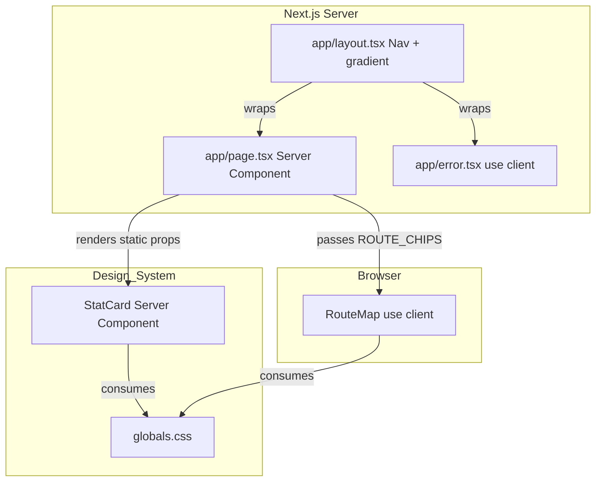
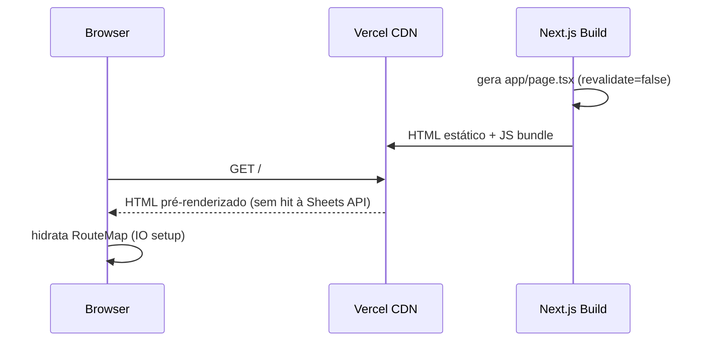

# Design Técnico — home-page

## Visão Geral

A Página Home (`app/page.tsx`) é a landing page estática do travel companion app Irlanda & UK 2026. Apresenta o header com gradiente roxo, quatro `StatCard` glassmorphism com métricas fixas da viagem, um mini-mapa horizontal do percurso entre 6 cidades e cards de acesso rápido às três seções principais.

**Usuários**: Os dois viajantes e familiares, em mobile (prioritário) e desktop.

**Impacto**: Introduz três novos arquivos (`app/page.tsx`, `app/error.tsx`, `components/RouteMap.tsx`); consome `StatCard` e `Nav` já definidos em `base-components`; não modifica nenhum arquivo existente.

### Objetivos

- Página 100% estática (sem chamadas à Sheets API em runtime).
- `StatCard` consumido com props literais; `Nav` herdado de `app/layout.tsx`.
- Mini-mapa horizontal com chips glassmorphism animados via Intersection Observer.
- Error Boundary raiz (`app/error.tsx`) captura falhas de renderização sem try/catch em `page.tsx`.

### Não-Objetivos

- Fetch de dados dinâmicos na Home.
- Lógica de navegação ou estado ativo do `Nav` (responsabilidade de `Nav` + `layout.tsx`).
- Internacionalização ou suporte a mais idiomas.

---

## Arquitetura

### Padrão & Mapa de Fronteiras

Server Component padrão com uma ilha cliente mínima (`RouteMap`) para Intersection Observer. Padrão idêntico ao de `roteiro-page` — boundary `"use client"` no menor escopo possível.



**Decisões-chave**:
- `app/page.tsx` é server component puro — `export const revalidate = false`, sem `useEffect`, sem fetch.
- `RouteMap.tsx` é o único Client Component; necessário exclusivamente para o Intersection Observer (Req 3.6).
- `StatCard` recebe props literais (`value`, `label`, `icon`); comportamento glassmorphism 100% via `.glass-card` em `globals.css`.
- `app/error.tsx` na raiz cobre a rota `/` e serve de fallback global para rotas sem error boundary próprio.

### Technology Stack

| Camada | Escolha | Papel | Notas |
|--------|---------|-------|-------|
| Framework | Next.js 14 App Router | SSG, roteamento, Error Boundary | `revalidate = false` — geração estática no build |
| Linguagem | TypeScript strict | Props tipadas, sem `any` | `RouteChip` definido localmente |
| Styling | Tailwind CSS + CSS custom properties | Layout, responsividade, design system | Cores via `var(--*)`, nunca hex inline |
| Animação | Intersection Observer API + CSS class | `fadeInUp` acionado ao entrar na viewport | Universal (Safari 12.1+); sem lib externa |
| Componentes | `StatCard`, `Nav` (base-components spec) | Primitivos de UI reutilizados | Sem modificação |

---

## Rastreabilidade de Requisitos

| Requisito | Resumo | Componente | Contrato |
|-----------|--------|------------|---------|
| 1.1 | Header com gradiente via CSS vars | `app/page.tsx` | CSS Token |
| 1.2 | `h1` bold branco "Irlanda & Reino Unido 2026" | `app/page.tsx` | — |
| 1.3 | Subtítulo com período e viajantes | `app/page.tsx` | — |
| 1.4 | `h1` ≤ 1.7rem em ≤ 480px | `app/page.tsx` (Tailwind) | — |
| 1.5 | Textura noise opacity 0.04 | `app/page.tsx` | — |
| 1.6 | `background-attachment: fixed` no body | `globals.css` (existente) | CSS Token |
| 2.1 | 4 `StatCard` com valores fixos | `app/page.tsx` | `StatCardProps` |
| 2.2 | Glassmorphism via `.glass-card` | `StatCard` (existente) | CSS Token |
| 2.3 | Valor âmbar 2.4rem/800 | `StatCard` (existente) | `StatCardProps` |
| 2.4 | Label branco abaixo do valor | `StatCard` (existente) | `StatCardProps` |
| 2.5 | Grid 2×2 em ≤ 768px | `app/page.tsx` (Tailwind) | — |
| 2.6 | Grid 4 colunas em ≥ 769px | `app/page.tsx` (Tailwind) | — |
| 2.7 | Valores hardcoded (sem Sheets fetch) | `app/page.tsx` | — |
| 3.1 | 6 cidades em ordem cronológica | `RouteMap` | `RouteChip[]` |
| 3.2 | Chips com nome, emoji e data | `RouteMap` | `RouteChip` |
| 3.3 | Seta `→` entre chips | `RouteMap` | — |
| 3.4 | Cor de acento `var(--c1)`–`var(--c6)` | `RouteMap` | `RouteChip.accentVar` |
| 3.5 | Scroll horizontal ≤ 768px | `RouteMap` (container) | — |
| 3.6 | `fadeInUp` via Intersection Observer | `RouteMap` | — |
| 4.1 | 3 cards de navegação | `app/page.tsx` | `NavSectionCard` |
| 4.2 | `<a>` para `/roteiro`, `/hospedagens`, `/transportes` | `app/page.tsx` | — |
| 4.3 | Ícone + título + descrição em cada card | `app/page.tsx` | `NavSectionCard` |
| 4.4 | Hover lift desktop | `app/page.tsx` (Tailwind) | — |
| 4.5 | Grid 3 colunas ≥ 769px | `app/page.tsx` (Tailwind) | — |
| 4.6 | Coluna única ≤ 768px | `app/page.tsx` (Tailwind) | — |
| 4.7 | Card branco, top stripe, border-radius 18px | `app/page.tsx` | — |
| 5.1 | Server Component (`app/page.tsx`) | `app/page.tsx` | — |
| 5.2 | Max-width 1000px, padding 1.5rem | `app/page.tsx` (Tailwind) | — |
| 5.3 | Ordem vertical: Header → Stats → Mini-mapa → Nav Cards | `app/page.tsx` | — |
| 5.4 | `slideDown` + `fadeInUp` com stagger | `app/page.tsx`, `RouteMap` | CSS keyframes |
| 5.5 | CLS ≈ 0 (sem fetch dinâmico) | `app/page.tsx` (estático) | — |
| 5.6 | Apenas CSS vars, sem hex inline | todos os componentes | — |
| 6.1 | `padding-bottom` para não sobrepor bottom nav | `app/page.tsx` (Tailwind) | — |
| 6.2 | Coluna única ≤ 768px | `app/page.tsx` (Tailwind) | — |
| 6.3 | Multi-coluna ≥ 769px | `app/page.tsx` (Tailwind) | — |
| 6.4 | Sem lógica do `Nav` na Home | `app/page.tsx` | — |
| 7.1 | SSG (`revalidate = false`) | `app/page.tsx` | — |
| 7.2 | Sem chamadas à Sheets API | `app/page.tsx` | — |
| 7.3 | Sem env vars no browser | `app/page.tsx` (server-only) | — |
| 7.4 | Error Boundary via `app/error.tsx` | `app/error.tsx` | `ErrorPageProps` |
| 7.5 | Lighthouse ≥ 90 mobile (estático + system font) | todos | — |

---

## Fluxo do Sistema

### Render Flow (SSG)



**Decisão-chave**: Sem ISR; a Home não tem dados externos. O bundle JS enviado ao browser contém apenas o código de `RouteMap.tsx` (IO setup).

---

## Componentes e Interfaces

### Sumário

| Componente | Camada | Intenção | Requisitos | Dependências-chave | Contratos |
|------------|--------|----------|------------|--------------------|-----------|
| `app/page.tsx` | Routing / Server | Orquestra layout estático da Home | 1–7 (todos) | `StatCard`, `RouteMap`, CSS tokens | Service |
| `app/error.tsx` | Routing / Client | Error Boundary da rota `/` | 7.4 | — | State |
| `components/RouteMap.tsx` | UI / Client | Mini-mapa horizontal com IO animation | 3.1–3.6 | CSS tokens `--c1`–`--c6` | State |

`StatCard` e `Nav` são consumidos sem modificação (ver `base-components/design.md`).

---

### Routing / Server

#### `app/page.tsx`

| Campo | Detalhe |
|-------|---------|
| Intent | Server Component estático: renderiza header, StatCards, RouteMap e NavSectionCards |
| Requirements | 1.1–1.6, 2.1–2.7, 4.1–4.7, 5.1–5.6, 6.1–6.4, 7.1–7.5 |

**Responsabilidades**
- Declarar `STAT_ITEMS`, `ROUTE_CHIPS` e `NAV_SECTION_CARDS` como constantes imutáveis no escopo do módulo.
- Renderizar seções na ordem: Hero Header → Stats → RouteMap → NavSectionCards.
- Passar props serializáveis para `RouteMap`; instanciar `StatCard` com valores literais.
- Exportar `revalidate = false` e `metadata`.

**Dependências**
- Outbound: `components/StatCard.tsx` — exibe métricas (P0)
- Outbound: `components/RouteMap.tsx` — mini-mapa animado (P0)
- Inbound: `app/layout.tsx` — fornece `Nav`, gradiente de fundo e `<main>` wrapper (P0)

**Contratos**: Service [x]

##### Service Interface

```typescript
export const revalidate = false; // SSG — sem revalidação

export const metadata: Metadata = {
  title: 'Home | Irlanda & UK 2026',
  description: 'Visão geral da viagem: 18 dias, 6 cidades, Irlanda e Reino Unido.',
};

export default function HomePage(): JSX.Element
```

##### Constantes de Dados

```typescript
interface StatItem {
  readonly value: number | string;
  readonly label: string;
  readonly icon: string;
}

const STAT_ITEMS: readonly StatItem[] = [
  { value: 18, label: 'dias',    icon: '📅' },
  { value: 6,  label: 'cidades', icon: '🏙️' },
  { value: 5,  label: 'trechos', icon: '✈️' },
  { value: 2,  label: 'amigas',  icon: '👭' },
] as const;

// NAV_SECTION_CARDS e ROUTE_CHIPS definidos na seção de componentes abaixo
```

**Notas de Implementação**
- Hero Header: `<header>` com `style={{ background: 'linear-gradient(135deg, var(--grad-start) 0%, var(--grad-end) 100%)' }}`. Textura noise via `<div aria-hidden="true">` absolutamente posicionado com SVG `feaTurbulence`.
- `h1` responsivo: `text-[clamp(1.7rem,4vw,2.5rem)]` ou `text-[1.7rem] sm:text-[2.5rem]`.
- Grid de StatCards: `grid grid-cols-2 md:grid-cols-4 gap-4`.
- Cards de navegação: `grid grid-cols-1 md:grid-cols-3 gap-6`. Top stripe via `::before` absoluto com `h-[4px]` e `background: linear-gradient(90deg, var(--primary), var(--accent))`.
- Padding bottom mobile: `pb-[80px] md:pb-8` para não colidir com bottom nav (Nav tem `h-[60px]` + safe-area).
- `slideDown` no header e `fadeInUp` nas seções: `@keyframes` já definidos em `globals.css`; aplicar via `style={{ animation: 'fadeInUp 0.6s ease forwards', animationDelay: '0.Xs' }}`.

---

### Routing / Client

#### `app/error.tsx`

| Campo | Detalhe |
|-------|---------|
| Intent | Error Boundary da rota `/`; exibe UI amigável sem expor stack trace |
| Requirements | 7.4 |

**Contrato**: State [x]

```typescript
'use client';

interface ErrorPageProps {
  readonly error: Error & { digest?: string };
  readonly reset: () => void;
}

export default function HomeError({ error, reset }: ErrorPageProps): JSX.Element
```

**Notas de Implementação**: Mesmo padrão do `app/roteiro/error.tsx` (ver `roteiro-page/design.md`): card glassmorphism, mensagem em português, botão "Tentar novamente" chamando `reset()`. Sem log de `error.message` em produção.

---

### UI / Client

#### `components/RouteMap.tsx`

| Campo | Detalhe |
|-------|---------|
| Intent | Mini-mapa horizontal com chips glassmorphism; anima cada chip via IO ao entrar na viewport |
| Requirements | 3.1–3.6 |

**Responsabilidades**
- Receber `chips: readonly RouteChip[]` como props serializáveis.
- Registrar `IntersectionObserver` em `useEffect` para cada chip ref; adicionar classe `is-visible` ao entrar na viewport.
- Renderizar container com `overflow-x: auto` em mobile e chips com setas entre eles.
- Não fazer fetch nem gerenciar estado além da visibilidade dos chips.

**Dependências**
- Inbound: `app/page.tsx` — passa `ROUTE_CHIPS` (P0)
- External: CSS custom properties `--c1`–`--c6`, `--glass`, `--glass-border` em `globals.css` (P0)

**Contratos**: State [x]

##### Props Interface

```typescript
'use client';

export interface RouteChip {
  readonly city: string;
  readonly emoji: string;
  readonly date: string;       // ex.: "27/08"
  readonly accentVar: string;  // ex.: "--c1"
}

interface RouteMapProps {
  readonly chips: readonly RouteChip[];
}

export default function RouteMap({ chips }: RouteMapProps): JSX.Element
```

##### Constante de Dados (declarada em `app/page.tsx`, passada via props)

```typescript
const ROUTE_CHIPS: readonly RouteChip[] = [
  { city: 'Dublin',    emoji: '🇮🇪', date: '27/08', accentVar: '--c1' },
  { city: 'Belfast',   emoji: '🇬🇧', date: '30/08', accentVar: '--c2' },
  { city: 'Edinburgh', emoji: '🏴󠁧󠁢󠁳󠁣󠁴󠁿', date: '01/09', accentVar: '--c3' },
  { city: 'Liverpool', emoji: '🏴󠁧󠁢󠁥󠁮󠁧󠁿', date: '04/09', accentVar: '--c4' },
  { city: 'London',    emoji: '🇬🇧', date: '07/09', accentVar: '--c5' },
  { city: 'Dublin',    emoji: '🇮🇪', date: '11/09', accentVar: '--c6' },
] as const;
```

##### State Management

```typescript
const chipRefs = useRef<(HTMLDivElement | null)[]>([]);

useEffect(() => {
  // Fallback para browsers sem IntersectionObserver.
  // @supports CSS nao detecta APIs JS — verificacao feita aqui, no ciclo de vida do componente.
  if (!('IntersectionObserver' in window)) {
    chipRefs.current.forEach((el) => el?.classList.add('is-visible'));
    return;
  }

  const observer = new IntersectionObserver(
    (entries) => {
      entries.forEach((entry) => {
        if (entry.isIntersecting) {
          entry.target.classList.add('is-visible');
          observer.unobserve(entry.target);
        }
      });
    },
    {
      threshold: 0.15,
      rootMargin: '0px 50px 0px 50px',
    }
  );

  // Snapshot do ref para cleanup seguro se o componente desmontar durante o loop
  const currentRefs = chipRefs.current;
  currentRefs.forEach((el) => { if (el) observer.observe(el); });

  return () => observer.disconnect();
}, [chips]); // chips como dependência: roda novamente se a lista mudar
```

##### CSS — classe `is-visible` (em `globals.css`)

```css
@layer components {
  .route-chip {
    opacity: 0;
    transform: translateY(16px);
  }
  .route-chip.is-visible {
    animation: fadeInUp 0.6s ease forwards;
  }
}
```

- **Preconditions**: `chips` é array não vazio; cada `accentVar` referencia variável definida em `:root`.
- **Invariant (IO presente)**: `observer.unobserve` garante que a animação dispara uma única vez por chip.
- **Invariant (IO ausente)**: Fallback no `useEffect` aplica `is-visible` em todos os chips imediatamente; nenhum chip fica invisível.

**Notas de Implementação**
- Container: `<ol aria-label="Percurso da viagem" className="flex items-center gap-3 overflow-x-auto pb-2 -mx-4 px-4 md:mx-0 md:px-0">` — `<ol>` semântico (ordem importa); `aria-label` fornece contexto a leitores de tela.
- Cada chip: `<li>` wrapper + `<div ref={(el) => { if (el) chipRefs.current[i] = el; }} className="route-chip glass-card flex-shrink-0 ...">` — ref condicional (`if (el)`) evita sobrescrever com `null` na desmontagem.
- Separador: `<li aria-hidden="true" className="text-white/60 flex-shrink-0">→</li>` entre chips (não após o último); `aria-hidden` oculta setas decorativas de leitores de tela.

---

## Modelos de Dados

Não há modelos de domínio novos. A Home consome apenas tipos locais imutáveis (`StatItem`, `RouteChip`); nenhum contato com `lib/types.ts` ou `lib/sheets.ts`.

```typescript
// Tipos locais — não exportados para lib/types.ts (não são dados da Sheets API)
interface StatItem { value: number | string; label: string; icon: string; }
interface NavSectionCard { href: string; icon: string; title: string; description: string; }
// RouteChip — exportado de RouteMap.tsx para ser passado como props pelo page.tsx
```

---

## Tratamento de Erros

| Cenário | Origem | Resposta |
|---------|--------|----------|
| Erro de renderização em `page.tsx` | Runtime (improvável — página estática) | `app/error.tsx` captura; UI amigável + botão reset |
| `accentVar` inválido em `RouteChip` | Dev typo | Chip sem cor de borda (fallback CSS gracioso; sem crash) |
| Prop `value`/`label` ausente em `StatCard` | Erro de compilação TypeScript | Falha em `tsc --noEmit`, não alcança runtime |
| IO não suportado (browser antigo) | Ambiente legado | `useEffect` detecta `!('IntersectionObserver' in window)` e aplica `is-visible` em todos os chips diretamente — nenhum chip fica invisível |

---

## Estratégia de Testes

### Testes Unitários
- `RouteMap` renderiza 6 chips e 5 separadores `→`.
- `RouteMap` com `chips.length === 1` não renderiza separador.
- `RouteMap` adiciona classe `is-visible` ao chip quando IO dispara `isIntersecting: true`.
- `HomePage` renderiza 4 `StatCard` com valores corretos (18, 6, 5, 2).
- `HomePage` renderiza 3 `NavSectionCard` com hrefs `/roteiro`, `/hospedagens`, `/transportes`.

### Testes de Integração
- `tsc --noEmit` passa após implementação de `page.tsx` e `RouteMap.tsx`.
- `npm run build` completa sem erros (inclui SSG da rota `/`).
- `<StatCard value={18} label="dias" icon="📅" />` renderiza sem erros.

### Testes E2E / UI
- Rota `/`: header visível com gradiente; 4 cards de stats; 6 chips de cidades; 3 cards de navegação.
- Desktop (≥ 769px): stats em 4 colunas; nav cards em 3 colunas; top nav visível.
- Mobile (≤ 768px): stats em 2×2; nav cards em coluna única; bottom nav visível; route map scrollável horizontalmente.
- Scroll horizontal do route map no mobile: chip inicialmente fora da viewport não tem `is-visible` antes do scroll; após scroll, `is-visible` adicionado e animação `fadeInUp` disparada.
- Clique nos 3 nav cards navega para as rotas corretas.

---

## Performance & Escalabilidade

- `revalidate = false` — HTML gerado uma vez no build; zero latência de API em runtime.
- Sem Web Font import — system font stack (`Segoe UI`, etc.) não bloqueia rendering.
- `RouteMap` JS bundle: apenas `useRef` + `useEffect` + IO setup — estimativa < 2 KB gzipped.
- Animações via CSS `@keyframes` no `globals.css` — thread principal livre; sem `requestAnimationFrame` manual.
