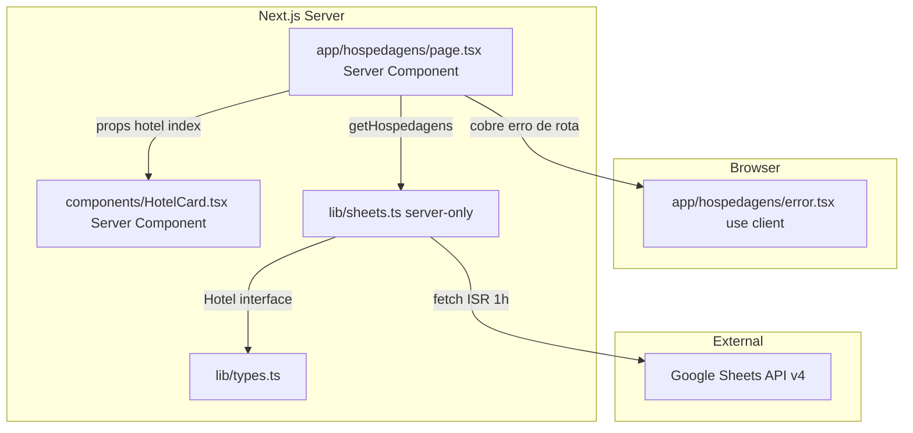
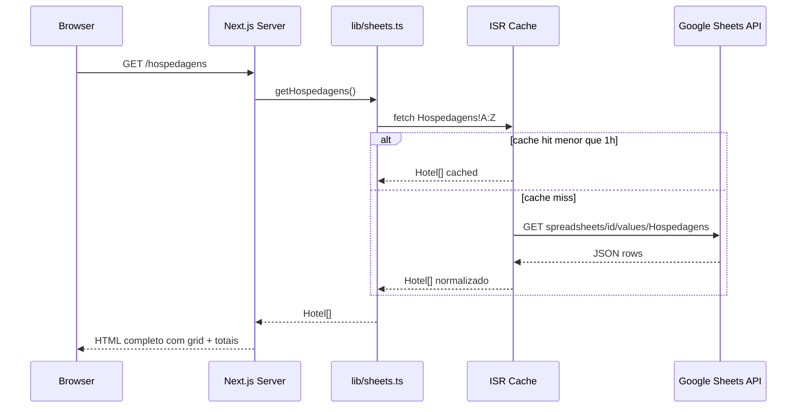
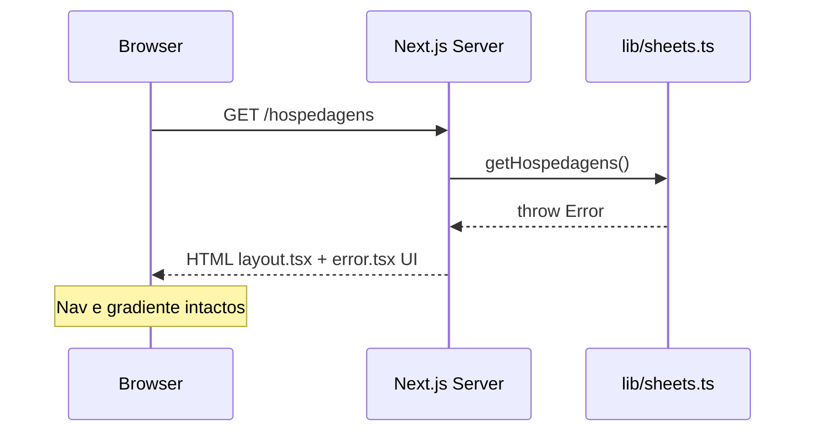

# Design Técnico — hospedagens-page

## Visão Geral

A página `/hospedagens` é o dashboard de alojamentos da viagem Irlanda & UK 2026. Busca dados server-side da aba `Hospedagens` do Google Sheets, renderiza um grid responsivo de `HotelCard`s com indicadores de status de confirmação e uma seção de totais financeiros como glass panel.

**Usuários**: Os dois viajantes, acessando via URL do Vercel antes e durante a viagem.

**Impacto**: Cria `app/hospedagens/page.tsx` e `app/hospedagens/error.tsx` (alinhando a rota com o link `/hospedagens` já presente em `Nav.tsx`). Remove `app/accommodations/page.tsx` (draft existente com rota incorreta). Atualiza `components/HotelCard.tsx` (fundo semi-transparente + hover CSS puro) e `lib/sheets.ts` (normalização de `status` em `getHospedagens`).

### Objetivos

- Rota `/hospedagens` funcional e consistente com `Nav.tsx`.
- Grid `grid-cols-1 md:grid-cols-2` via Tailwind nativo, sem `@media` customizado.
- `HotelCard` como Server Component puro: hover via CSS `transition` + classes `hover:` do Tailwind.
- `export const revalidate = 300` em `page.tsx` garantindo ISR de 5 min independente de SDK.
- Normalização de `status` em `getHospedagens` antes do cast para `HotelStatus`.
- Seção de totais como glass panel com breakdown por moeda.

### Não-Objetivos

- Filtro ou ordenação de hotéis pelo usuário.
- Conversão automática de moedas (estimativa BRL como referência apenas, sem totalizar).
- Revalidação sob demanda via webhook.
- Animações além de `fadeInUp` de entrada.

---

## Arquitetura

### Análise da Arquitetura Existente

- `app/accommodations/page.tsx` existe como draft mas a rota `/accommodations` não está linkada na navegação — `Nav.tsx` já aponta para `/hospedagens`. O draft serve de referência de implementação e deve ser removido.
- `HotelCard.tsx` usa `onMouseEnter/onMouseLeave` sem `"use client"` — comportamento indefinido em App Router. Substituir por hover CSS puro.
- `getHospedagens` em `sheets.ts` não normaliza `status` antes do cast para `HotelStatus`. Linhas com `"Confirmado"` (casing diferente) falhariam silenciosamente nas comparações.
- `accommodations/page.tsx` usa `@media (max-width: 768px)` inline em `<style>` — violar Req 2.1/2.2; substituir por `grid-cols-1 md:grid-cols-2`.

### Padrão & Mapa de Fronteiras

Server Component por padrão; `error.tsx` é o único arquivo com `"use client"` (exigido pelo Next.js para Error Boundaries).



**Decisões-chave**:
- `HotelCard` é Server Component puro — nenhum estado ou efeito; hover via Tailwind `hover:-translate-y-1 hover:shadow-xl transition-all duration-300`.
- Totais financeiros calculados via helper puro `calculateHospedagensTotals(hotels: Hotel[]): TotalsByMoeda` extraído em `lib/finance.ts` — permite teste unitário isolado sem dependência do ambiente Next.js Server Component.
- `export const revalidate = 300` em `page.tsx` garante ISR no nível da rota com janela de 5 minutos, ideal para o período de viagem onde atualizações na planilha precisam refletir rapidamente no site.

### Stack de Tecnologia

| Camada | Escolha | Papel | Notas |
|--------|---------|-------|-------|
| Framework | Next.js 14 App Router | SSR/ISR, roteamento, Error Boundary | `export const revalidate = 300` em `page.tsx` (5 min) |
| Linguagem | TypeScript strict | Tipagem de props e contratos | Sem `any`; `Hotel`, `HotelStatus`, `Currency` de `lib/types.ts` |
| Styling | Tailwind CSS + CSS custom properties | Layout responsivo e design system | `grid-cols-1 md:grid-cols-2`; hover via `hover:` utilities; cores via `var(--*)` |
| Animação | CSS `@keyframes fadeInUp` + `animationDelay` inline | Entrada escalonada por índice | Definido em `globals.css` (existente) |
| Dados | `lib/sheets.ts` — `getHospedagens()` | Fetch server-side + normalização | `server-only` guard; normalização de `status` e campos numéricos |
| Tipos | `lib/types.ts` | Contratos de domínio | `Hotel`, `HotelStatus`, `Currency` — imutáveis (`readonly`) |

---

## Fluxos do Sistema

### Fetch Flow (SSR/ISR)



### Error Flow



---

## Rastreabilidade de Requisitos

| Req | Resumo | Componentes | Contrato | Fluxo |
|-----|--------|-------------|---------|-------|
| 1.1 | Fetch `Hospedagens!A:Z` server-side | `page.tsx` | `SheetsClient.getHospedagens` | Fetch Flow |
| 1.2 | `export const revalidate = 300` em `page.tsx` (5 min — dinamismo em viagem) | `page.tsx` | — | — |
| 1.3 | Credenciais nunca no bundle cliente | `lib/sheets.ts`, `page.tsx` | — | — |
| 1.4 | Retorno tipado `Hotel[]` | `lib/sheets.ts` | `Hotel` | — |
| 1.5 | Error Boundary `error.tsx` preserva layout | `error.tsx` | `ErrorPageProps` | Error Flow |
| 1.6 | Normalização: `status` → `.trim().toLowerCase()`; numéricos → `Number` + `isNaN` | `lib/sheets.ts` — `getHospedagens` | `Hotel` | — |
| 1.7 | Linhas inválidas descartadas silenciosamente | `lib/sheets.ts` — `getHospedagens` | — | — |
| 2.1 | `grid-cols-1 md:grid-cols-2` sem `@media` custom | `page.tsx` | — | — |
| 2.2 | Apenas Tailwind utilitário para grid | `page.tsx` | — | — |
| 2.3 | Cabeçalho com título + total de hospedagens | `page.tsx` | — | — |
| 2.4 | Gap consistente Tailwind entre cards | `page.tsx` | — | — |
| 2.5 | Um `HotelCard` por registro | `page.tsx` | `HotelCardProps` | — |
| 3.1–3.8 | Campos do card (nome, cidade, datas, noites, preço, link, obs, endereço) | `HotelCard` | `HotelCardProps` | — |
| 3.9 | Props tipada como `Hotel` sem `any` | `HotelCard` | `HotelCardProps` | — |
| 4.1–4.2 | Badge verde/âmbar por `status` | `HotelCard` | — | — |
| 4.3–4.4 | Top stripe gradiente por `status` | `HotelCard` | — | — |
| 4.5 | Badge styling com CSS custom properties | `HotelCard` | — | — |
| 5.1 | Seção de totais após grid | `page.tsx` | — | — |
| 5.2 | Total EUR (moeda normalizada) | `page.tsx` | — | — |
| 5.3 | Total de noites | `page.tsx` | — | — |
| 5.4 | Contagem confirmados/total | `page.tsx` | — | — |
| 5.5 | Totais por moeda separados quando múltiplas | `page.tsx` | — | — |
| 6.1 | Background gradiente herdado de `layout.tsx` | `layout.tsx` (existente) | — | — |
| 6.2 | `bg-white/80 backdrop-blur-md` nos cards | `HotelCard` | — | — |
| 6.3 | Hover lift CSS (`hover:-translate-y-1`) | `HotelCard` | — | — |
| 6.4 | `fadeInUp` + `animationDelay` inline por índice | `HotelCard` | — | — |
| 6.5 | Apenas CSS custom properties — sem hex inline | `page.tsx`, `HotelCard` | — | — |
| 6.6 | Tipografia Segoe UI | `globals.css` (existente) | — | — |
| 6.7 | Seção de totais como glass panel | `page.tsx` | — | — |

---

## Componentes e Interfaces

### Sumário

| Componente | Camada | Intenção | Requisitos | Dependências-chave | Contrato |
|------------|--------|----------|------------|-------------------|---------|
| `app/hospedagens/page.tsx` | Routing / Server | Orquestra fetch, delega cálculo de totais, renderiza grid + estado vazio | 1.1–1.3, 2.1–2.5, 5.1–5.5, 6.1, 6.3–6.7 | `getHospedagens`, `calculateHospedagensTotals`, `HotelCard`, `StatCard`, `Hotel` | Service |
| `app/hospedagens/error.tsx` | Routing / Client | Error Boundary da rota `/hospedagens` | 1.5 | — | State |
| `components/HotelCard.tsx` | UI / Server | Exibe campos + badge de status + top stripe; `h-full flex flex-col` para altura uniforme | 3.1–3.9, 4.1–4.5, 6.2–6.4 | `Hotel`, CSS tokens | Service |
| `lib/sheets.ts` — `getHospedagens` | Data / Server | Fetch + normalização + cast para `Hotel[]` | 1.1, 1.4, 1.6, 1.7 | `fetchSheetRange`, `Hotel` | Service |
| `lib/finance.ts` — `calculateHospedagensTotals` | Logic / Pure | Helper puro — agrupa `preco_total` por moeda com contagem por status | 5.1–5.5 | `Hotel`, `TotalsByMoeda` | Service |

---

### Routing / Server

#### `app/hospedagens/page.tsx`

| Campo | Detalhe |
|-------|---------|
| Intent | Server Component que busca `Hotel[]`, calcula totais por moeda e renderiza grid + seção de totais glass panel |
| Requirements | 1.1–1.3, 2.1–2.5, 5.1–5.5, 6.1, 6.3–6.7 |

**Responsabilidades**
- Chamar `getHospedagens()` e receber `Hotel[]` — nenhum estado ou efeito.
- Calcular server-side: `totalNights` (soma de `noites`), `confirmedCount`, `totalByMoeda` (grouped `preco_total` por `moeda`).
- Renderizar container grid com classes Tailwind `grid grid-cols-1 md:grid-cols-2 gap-5`.
- Passar `hotel` e `index` para `HotelCard`; o `animationDelay` é aplicado em `HotelCard` via prop `index`.
- Renderizar seção de totais como glass panel (`var(--glass)`, `backdrop-filter: blur(16px)`, `border: 1px solid var(--glass-border)`) após o grid.
- Exportar `metadata` com `title` e `description`.

**Dependências**
- Outbound: `lib/sheets.ts` — `getHospedagens()` (P0)
- Outbound: `components/HotelCard.tsx` — renderização de cada hotel (P0)
- Outbound: `components/StatCard.tsx` — stat chips no summary bar (P1)
- Inbound: `app/layout.tsx` — fornece fundo, nav e `<main>` wrapper (P0)

**Contrato**: Service [x]

##### Service Interface

```typescript
export const revalidate = 300; // 5 minutos — dinamismo durante a viagem

export const metadata: Metadata = {
  title: 'Hospedagens | Irlanda & UK 2026',
  description: 'Hotéis confirmados e pendentes por cidade.',
};

// Estrutura de totais calculada server-side
interface TotalsByMoeda {
  readonly [moeda: string]: {
    readonly confirmed: number;
    readonly pending: number;
    readonly total: number;
  };
}

export default async function HospedagensPage(): Promise<JSX.Element>
```

- Pré-condição: `GOOGLE_SHEETS_ID` e `GOOGLE_API_KEY` disponíveis em `process.env` (validados em `lib/sheets.ts`).
- Pós-condição: Retorna JSX com grid de `hotels.length` `HotelCard`s e seção de totais.
- Invariante: Se `getHospedagens()` lançar exceção, Next.js redireciona para `error.tsx` — `page.tsx` nunca retorna HTML de erro.

**Notas de Implementação**
- Container externo: `max-w-[1000px] mx-auto px-6 pb-24 pt-10`.
- Grid: `<div className="grid grid-cols-1 md:grid-cols-2 gap-5 mb-12">`.
- **Estado vazio**: se `hotels.length === 0` após `getHospedagens()`, renderizar glass panel com a mensagem "Nenhuma hospedagem válida encontrada. Verifique o preenchimento da planilha." em vez do grid e da seção de totais — evita que `reduce` opere sobre array vazio e fornece feedback visual claro ao usuário.
- `totalByMoeda` calculado via `calculateHospedagensTotals(hotels)` (helper de `lib/finance.ts`) — exibido como linhas separadas na seção de totais quando há múltiplas moedas.
- Seção de totais usa `var(--glass)` + `backdrop-filter`; números em `var(--warning)` (amber) seguindo padrão de `StatCard`.
- **Formatação monetária**: usar `Intl.NumberFormat` nativo no Server Component para formatar valores exibidos na seção de totais e no `HotelCard`. Exemplo canônico a seguir no código de produção:
  ```typescript
  const formatCurrency = (value: number, currency: string) =>
    new Intl.NumberFormat('pt-BR', { style: 'currency', currency }).format(value);
  // 150 EUR → "€ 150,00" | 150 GBP → "£ 150,00" | 150 BRL → "R$ 150,00"
  ```
- Nenhum `@media` custom em `<style>` — todo responsivo via Tailwind.

---

### Routing / Client

#### `app/hospedagens/error.tsx`

| Campo | Detalhe |
|-------|---------|
| Intent | Error Boundary da rota `/hospedagens` — exibe mensagem amigável sem expor stack trace |
| Requirements | 1.5 |

**Contrato**: State [x]

##### State Management

```typescript
'use client';

interface ErrorPageProps {
  readonly error: Error & { digest?: string };
  readonly reset: () => void;
}

export default function HospedagensError({ error, reset }: ErrorPageProps): JSX.Element
```

- Estado: nenhum estado local além do `error` e `reset` recebidos pelo Next.js.
- Não exibir `error.message` ao usuário — usar apenas `error.digest` (opaco) se necessário.

**Notas de Implementação**
- Mesmo estilo glassmorphism do `roteiro-page/error.tsx` — glass panel com botão "Tentar novamente".
- Segue o padrão idêntico ao `app/roteiro/error.tsx` (já implementado).

---

### UI / Server

#### `components/HotelCard.tsx`

| Campo | Detalhe |
|-------|---------|
| Intent | Card de hospedagem — exibe nome, cidade, datas, preço, status badge e top stripe; hover via CSS puro |
| Requirements | 3.1–3.9, 4.1–4.5, 6.2–6.4 |

**Responsabilidades**
- Renderizar todos os campos de `Hotel` conforme Req 3.1–3.8.
- Determinar `isConfirmed = hotel.status === 'confirmado'` e aplicar top stripe e badge correspondentes.
- Aplicar `animationDelay` via `style` inline baseado em `index`.
- Manter fundo semi-transparente `bg-white/80 backdrop-blur-md`.
- Hover lift via classes Tailwind — zero JavaScript de interação.

**Dependências**
- Inbound: `app/hospedagens/page.tsx` — passa `hotel: Hotel`, `index: number` (P0).
- External: CSS custom properties `--primary`, `--accent`, `--success`, `--warning`, `--dark`, `--light` em `globals.css` (P0).

**Contrato**: Service [x]

##### Props Interface

```typescript
import type { Hotel } from '@/lib/types';

interface HotelCardProps {
  readonly hotel: Hotel;
  readonly index: number;
}

export default function HotelCard({ hotel, index }: HotelCardProps): JSX.Element
```

##### Contratos de Renderização Condicional

```typescript
// Top stripe — div absoluta no topo do card
// isConfirmed = true  → gradient var(--primary) → var(--accent)
// isConfirmed = false → gradient var(--warning) → #e9b000

// Badge de status
// isConfirmed = true  → bg: rgba(0,184,148,0.12) | color: var(--success) | border: rgba(0,184,148,0.3) | "✅ Confirmado"
// isConfirmed = false → bg: rgba(253,203,110,0.15) | color: #c07900 | border: rgba(253,203,110,0.5) | "⏳ Pendente"

// Link de booking — renderizado somente quando hotel.link_booking !== undefined
// Observações — renderizadas somente quando hotel.observacoes !== undefined
// Endereço — renderizado somente quando hotel.endereco !== ''

// Animation delay
const animationStyle = { animationDelay: `${index * 0.1}s` } as React.CSSProperties;
```

**Notas de Implementação**
- Raiz do card: `className="relative overflow-hidden rounded-[18px] bg-white/80 backdrop-blur-md shadow-[0_8px_32px_rgba(0,0,0,0.1)] hover:-translate-y-1 hover:shadow-[0_18px_52px_rgba(0,0,0,0.14)] transition-all duration-300 h-full flex flex-col justify-between"` + `style={animationStyle}` com `animation: 'fadeInUp 0.6s ease-out both'`. O `h-full` garante que cada card ocupe toda a altura do slot do grid; o `flex flex-col justify-between` empurra o bloco preço+booking para a base do card, mantendo alinhamento visual entre cards vizinhos independentemente da quantidade de texto.
- Top stripe: `<div className="absolute top-0 inset-x-0 h-1" style={{ background: isConfirmed ? 'linear-gradient(90deg, var(--primary), var(--accent))' : 'linear-gradient(90deg, var(--warning), #e9b000)' }} />`.
- Meta grid (check-in, check-out, noites): `grid grid-cols-2 gap-3` com fundo `var(--light)`, `border-radius: 10px`.
- Price row: fundo com `linear-gradient(135deg, rgba(108,92,231,0.06), rgba(255,107,138,0.06))`.
- `link_booking`: `<a target="_blank" rel="noopener noreferrer">` com `var(--primary)` como fundo.
- Nenhum valor hexadecimal inline além de variações de alpha (`rgba`) que referenciam implicitamente os tokens de cor.

---

### Data / Server

#### `lib/sheets.ts` — `getHospedagens`

| Campo | Detalhe |
|-------|---------|
| Intent | Busca, normaliza e retorna `Hotel[]` da aba `Hospedagens` |
| Requirements | 1.1, 1.4, 1.6, 1.7 |

**Responsabilidades**
- Chamar `fetchSheetRange('Hospedagens!A:Z')`.
- Normalizar cada linha antes do cast: `status → .trim().toLowerCase()`, campos numéricos → `Number(raw.trim())` + verificação de `isNaN`.
- Descartar silenciosamente linhas com `status` inválido ou campos numéricos obrigatórios `NaN`.
- Retornar `Hotel[]` tipado sem uso de `any`.

**Contrato**: Service [x]

##### Service Interface

```typescript
// Assinatura pública — sem alteração
export async function getHospedagens(): Promise<Hotel[]>

// Normalização interna (não exposta) — aplicada antes do cast
// status:      raw.trim().toLowerCase() — aceito se === 'confirmado' || === 'pendente'
// preco_total: Number(raw.trim())       — linha descartada se isNaN
// noites:      Number(raw.trim())       — linha descartada se isNaN
// moeda:       raw.trim().toUpperCase() — cast para Currency
// demais:      raw.trim()
```

- Pré-condição: `fetchSheetRange` retorna `string[][]` com header na primeira linha.
- Pós-condição: Array de `Hotel` com todos os campos validados; linhas inválidas ausentes sem exceção.
- Invariante: `getHospedagens` não lança exceção por dado inválido — apenas por falha de rede ou coluna obrigatória ausente.

**Notas de Implementação**
- A lógica de normalização pode ser implementada como `normalizeHotelRow(raw: Record<string, string>): Hotel | null` — retorna `null` para linhas inválidas, depois filtrado com `.filter(Boolean)`.
- `console.warn` com índice da linha descartada para facilitar debugging durante edição da planilha.
- Não usa Zod — normalização via JS nativo alinhada com a diretriz da steering de manter dependências mínimas.

---

### Logic / Pure

#### `lib/finance.ts` — `calculateHospedagensTotals`

| Campo | Detalhe |
|-------|---------|
| Intent | Helper puro sem efeitos colaterais — recebe `Hotel[]` e devolve totais agrupados por moeda, testável de forma isolada |
| Requirements | 5.1–5.5 |

**Responsabilidades**
- Iterar `hotels` via `reduce`, agrupando `preco_total` por `moeda` com acumuladores `confirmed` e `pending`.
- Retornar `TotalsByMoeda` — o mesmo tipo exposto em `page.tsx`.
- Não lançar exceções — opera somente sobre `Hotel[]` já validado.

**Contrato**: Service [x]

##### Service Interface

```typescript
// lib/finance.ts
import type { Hotel } from '@/lib/types';

export interface TotalsByMoeda {
  readonly [moeda: string]: {
    readonly confirmed: number;
    readonly pending: number;
    readonly total: number;
  };
}

export function calculateHospedagensTotals(hotels: Hotel[]): TotalsByMoeda
```

- Pré-condição: `hotels` é `Hotel[]` validado — sem `NaN` em `preco_total`.
- Pós-condição: cada chave de `TotalsByMoeda` corresponde a uma moeda presente em `hotels`; `total = confirmed + pending`.
- Invariante: função pura — sem I/O, sem `console.*`, sem dependência de ambiente Next.js.

**Notas de Implementação**
- Arquivo novo `lib/finance.ts` — não requer `import 'server-only'` (é lógica pura, pode ser importado em testes Node.js sem setup do Next.js).
- `page.tsx` importa `calculateHospedagensTotals` e passa o resultado para a seção de totais, substituindo o `reduce` inline anterior.

---

## Modelos de Dados

### Modelo de Domínio

`HotelCard` e `HospedagensPage` consomem a interface `Hotel` já definida em `lib/types.ts` sem modificação:

```typescript
// lib/types.ts — contrato existente (spec typescript-types)
export type HotelStatus = 'confirmado' | 'pendente';
export type Currency = 'EUR' | 'GBP' | 'BRL';

export interface Hotel {
  readonly id: string;           // gerado em sheets.ts: "${idx+1}-${nome_hotel}"
  readonly cidade: string;
  readonly nome_hotel: string;
  readonly data_checkin: string;  // "DD/MM"
  readonly data_checkout: string; // "DD/MM"
  readonly noites: number;        // sempre >= 0 após normalização
  readonly preco_total: number;   // sempre número válido após normalização
  readonly moeda: Currency;       // 'EUR' | 'GBP' | 'BRL'
  readonly status: HotelStatus;   // 'confirmado' | 'pendente'
  readonly endereco: string;      // string vazia se ausente
  readonly link_booking?: string; // undefined se ausente
  readonly observacoes?: string;  // undefined se ausente
}
```

Invariantes consumidos pela página:
- `status` é sempre `'confirmado'` ou `'pendente'` — normalizado antes do cast.
- `preco_total` e `noites` são números válidos — linhas com NaN descartadas em `getHospedagens`.
- `endereco` pode ser string vazia — `HotelCard` oculta o campo nesse caso.

---

## Tratamento de Erros

### Estratégia

| Categoria | Origem | Tratamento | Componente |
|-----------|--------|-----------|------------|
| Falha da Sheets API (HTTP 5xx, timeout) | `fetchSheetRange` lança `Error` | Next.js → `error.tsx` UI amigável | `error.tsx` |
| Credenciais ausentes | `sheets.ts` lança no módulo scope | Mesmo fluxo → `error.tsx` | `error.tsx` |
| Coluna obrigatória ausente na planilha | `mapRowsToType` lança `Error` | Mesmo fluxo → `error.tsx` | `error.tsx` |
| Linha com dado inválido (`status` desconhecido, NaN) | `normalizeHotelRow` retorna `null` | Descarte silencioso + `console.warn` | `lib/sheets.ts` |
| Array vazio pós-validação (`hotels.length === 0`) | Todas as linhas descartadas ou planilha vazia | `page.tsx` renderiza mensagem visual: "Nenhuma hospedagem válida encontrada. Verifique o preenchimento da planilha." — a seção de totais não é renderizada | `page.tsx` |
| Campo opcional vazio (`link_booking`, `observacoes`) | `Hotel.link_booking?: string` | `HotelCard` não renderiza o campo | `HotelCard` |

---

## Estratégia de Testes

### Testes Unitários

- `normalizeHotelRow`: normaliza `"Confirmado"` → `"confirmado"`; descarta linha com `preco_total = "abc"`; preserva `link_booking` ausente como `undefined`.
- `calculateHospedagensTotals` (helper puro em `lib/finance.ts`): calcula `TotalsByMoeda` corretamente para múltiplas moedas sem setup Next.js; retorna `{}` para array vazio.
- `HotelCard` com `status = 'confirmado'`: renderiza `"✅ Confirmado"` e aplica classe de top stripe correta.
- `HotelCard` com `status = 'pendente'`: renderiza `"⏳ Pendente"`.
- `HotelCard` sem `link_booking`: não renderiza elemento `<a>`.

### Testes de Integração

- `HospedagensPage` com mock retornando `Hotel[]` misto (EUR + GBP): seção de totais exibe ambas as moedas formatadas via `Intl.NumberFormat`.
- `HospedagensPage` com mock retornando `[]`: renderiza glass panel com mensagem de planilha vazia; nenhuma seção de totais presente no HTML.
- `HospedagensPage` com mock lançando erro: `error.tsx` é ativado pelo Next.js Test Utils.
- `getHospedagens` com fixture de planilha contendo linha com `status = " CONFIRMADO "`: retorna `HotelStatus = 'confirmado'`.

### Testes E2E / UI

- Acesso a `/hospedagens`: grid visível com todos os cards.
- Viewport 375px: grid colapsa para 1 coluna; sem overflow horizontal.
- Card com `status = 'confirmado'`: badge verde visível, top stripe roxo/rosa.
- Seção de totais presente e exibe valor EUR.
- Hover em card (desktop): elevação visual observável.

---

## Considerações de Segurança

- `lib/sheets.ts` tem `import 'server-only'` — impede inclusão no bundle do browser.
- `page.tsx` não serializa `process.env` como prop — `GOOGLE_API_KEY` jamais alcança o cliente.
- `error.tsx` não exibe `error.message` ao usuário — sem vazamento de informação de infraestrutura.
- `link_booking` renderizado com `rel="noopener noreferrer"` — proteção contra `window.opener` hijacking.

---

## Performance & Escalabilidade

- ISR 5 min (`revalidate = 300`): máximo 1 requisição à Sheets API a cada 5 minutos por região Vercel Edge — adequado à quota da Sheets API com apenas 2 usuários.
- Hover via CSS `transition` — zero JavaScript de interação no bundle.
- `HotelCard` é Server Component — nenhuma hidratação por card; HTML puro servido ao cliente.
- `animationDelay` via `style` inline: nenhuma leitura de DOM ou `requestAnimationFrame`.
