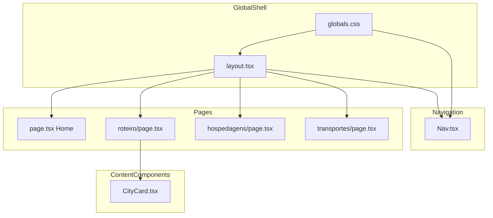

# Design Document — Responsividade Mobile

## Visão Geral

Esta feature garante que o Travel Companion App (Irlanda & UK 2026) ofereça uma experiência nativa em dispositivos móveis. Os requisitos cobrem cinco domínios: navegação inferior com barra de abas, colapso de grids para coluna única, timeline de roteiro em layout vertical, tipografia responsiva com `clamp()`, e suporte a safe area em dispositivos com notch.

**Usuários-alvo**: Os dois viajantes acessando o app em smartphones durante a viagem.
**Impacto**: Modifica `layout.tsx` (centralização de padding e viewport meta), `Nav.tsx` (fallback CSS e feedback `:active`), `globals.css` (variáveis e regras `@supports`), e `CityCard.tsx` (scroll-into-view ao expandir). Não altera a camada de dados.

### Objetivos

- Centralizar a lógica de padding inferior em `layout.tsx`, eliminando valores inconsistentes nas 4 páginas.
- Implementar fallback de cor sólida para `backdrop-filter: blur` em browsers sem suporte.
- Adicionar feedback visual `:active` nas abas da navegação mobile.
- Garantir visibilidade do topo do `CityCard` ao expandir em viewport estreita.
- Adicionar `viewport-fit=cover` ao layout raiz via Next.js 14 `viewport` export.

### Não-Objetivos

- Redesenho de qualquer componente de conteúdo (HotelCard, TransportCard, StatCard).
- Alteração da camada de dados (Google Sheets, `lib/sheets.ts`).
- Suporte a SSR condicional por user-agent.
- Introdução de breakpoints Tailwind customizados além dos nativos.

---

## Rastreabilidade de Requisitos

| Requisito | Resumo | Componentes | Contratos | Observação |
|-----------|--------|-------------|-----------|------------|
| 1.1 | Bottom nav ≤ 768px, top nav > 768px | `Nav` | State | Já implementado; sem alteração estrutural |
| 1.2 | 4 abas iguais com ícone + rótulo | `Nav` | State | Já implementado |
| 1.3 | `env(safe-area-inset-bottom)` no padding da bottom nav | `Nav` | — | Já implementado |
| 1.4 | `backdrop-filter: blur(20px)` + fallback sólido via `@supports` | `Nav`, `globals.css` | Service | **Gap**: adicionar classe `.nav-mobile` com fallback |
| 1.5 | Estado active/inactive + feedback `:active` de opacidade | `Nav` | State | **Gap**: adicionar `:active` opacity 0.8 |
| 1.6 | Top nav visível > 768px | `Nav` | — | Já implementado |
| 1.7 | Padding inferior centralizado em `layout.tsx` | `RootLayout` | Service | **Gap crítico**: centralizar com CSS var |
| 2.1 | Cards de hospedagem em 1 coluna ≤ 768px | `hospedagens/page.tsx` | — | Já implementado (`grid-cols-1 md:grid-cols-2`) |
| 2.2 | StatCards empilhados em mobile | `page.tsx` | — | Implementado (`grid-cols-2 md:grid-cols-4`); 2 colunas aceito |
| 2.3 | Grid de 2 colunas > 768px | `hospedagens/page.tsx` | — | Já implementado |
| 2.4 | Tailwind `md:` = 768px; sem breakpoints customizados | Todos | — | Consolidado no design |
| 2.5 | Cards `w-full` com padding horizontal mínimo `1rem` | Todas as páginas | — | Já implementado |
| 3.1 | Timeline coluna única ≤ 768px | `roteiro/page.tsx` | — | Já implementado (media query inline) |
| 3.2 | Timeline zigue-zague > 768px | `roteiro/page.tsx` | — | Já implementado |
| 3.3 | Expansão/colapso funcional + scroll-into-view no mobile | `CityCard` | State | **Gap**: adicionar `scrollIntoView` |
| 3.4 | CityCard `w-full` no mobile | `roteiro/page.tsx` | — | Já implementado (`justify-self: stretch`) |
| 3.5 | Borda lateral colorida preservada em ambos os breakpoints | `CityCard` | — | Já implementado |
| 4.1–4.3 | Tipografia `h1` fluida via `clamp()`; sem overflow | Todas as páginas | — | Já implementado (`clamp()` nos `h1`s) |
| 4.4 | `font-weight: 800` em headings em todos os breakpoints | Todas as páginas | — | Já implementado |
| 5.1 | Padding horizontal mínimo `1rem` em mobile | Todas as páginas | — | Já implementado |
| 5.2 | Gap mínimo `1rem` entre cards empilhados | Todas as páginas | — | Já implementado |
| 5.3 | Áreas de toque mínimas `44px` | `CityCard`, `Nav` | — | Já implementado (`min-h-[44px]`) |
| 5.4 | Padding inferior — atendido via Req 1.7 | `RootLayout` | — | Consolidado em 1.7 |
| 6.1 | `env(safe-area-inset-bottom)` na bottom nav | `Nav` | — | Já implementado |
| 6.2 | `viewport-fit=cover` em `layout.tsx` | `RootLayout` | — | **Gap**: adicionar `viewport` export |
| 6.3 | Fallback `padding-bottom: 0` quando `env()` não suportado | `RootLayout` | — | Garantido por `env(safe-area-inset-bottom,0px)` |
| 6.4 | Bottom nav não sobrepõe conteúdo interativo | `RootLayout`, `Nav` | — | Atendido por 1.7 |

---

## Arquitetura

### Análise da Arquitetura Existente

O projeto segue Next.js 14 App Router com server components por padrão. A separação de responsabilidades é: `app/layout.tsx` = shell global (Nav + fundo), `app/*/page.tsx` = conteúdo server-side, `components/` = UI reutilizável client-side. CSS: Tailwind para layout, variáveis CSS em `globals.css` para paleta.

**Estado atual dos gaps** (ver `research.md` para detalhes):
- `layout.tsx` não tem `viewport` export nem padding centralizado no `<main>`.
- Cada página gerencia padding-bottom individualmente com valores inconsistentes (80px, 96px, 6rem).
- `Nav.tsx` não tem classe CSS para fallback `@supports` nem `:active` feedback.
- `CityCard.tsx` não tem `useRef`/`scrollIntoView` ao expandir.

### Mapa de Fronteiras e Componentes



**Decisões-chave**:
- `layout.tsx` passa a ser o ponto único de controle do padding inferior mobile — as páginas perdem seus bottom paddings individuais.
- `Nav.tsx` migra o bloco de estilos da bottom nav de `style={{}}` inline para className `.nav-mobile` definida em `globals.css`, necessário para aplicar `@supports`.
- `CityCard.tsx` permanece `"use client"` e adiciona `useRef` no `<li>` raiz; nenhuma nova dependência.

### Technology Stack

| Camada | Tecnologia | Papel nesta feature |
|--------|------------|---------------------|
| Frontend | Next.js 14 App Router | Shell global (`layout.tsx`), `viewport` export |
| Estilização | Tailwind CSS v3 (JIT) | Breakpoint `md:` (768px), `pb-[calc(...)]` com `env()` |
| Estilização | CSS custom properties (`globals.css`) | `--nav-height-mobile`, `.nav-mobile`, `@supports` fallback |
| Interatividade | React 18 (`useState`, `useRef`) | `CityCard` expand + scroll |

---

## Componentes e Interfaces

### Sumário

| Componente | Camada | Intenção | Req Cobertos | Dependências P0 | Contratos |
|------------|--------|----------|--------------|-----------------|-----------|
| `RootLayout` | Global Shell | Centraliza viewport meta e padding inferior mobile | 1.7, 6.2, 6.3, 6.4, 5.4 | `globals.css` (P0) | Service |
| `Nav` | Navigation | Bottom tab bar com fallback blur e feedback `:active` | 1.1–1.6, 6.1 | `globals.css` (P0) | State |
| `globals.css` | Estilização | Define variáveis e regra `@supports` para fallback blur | 1.4, 1.7 | — | — |
| `CityCard` | Content | Scroll-into-view ao expandir card em mobile | 3.3 | `useRef` React (P0) | State |

---

### Global Shell

#### `RootLayout` (`app/layout.tsx`)

| Campo | Detalhe |
|-------|---------|
| Intent | Shell raiz: viewport meta, fundo gradient, Nav, e padding inferior mobile centralizado |
| Requirements | 1.7, 5.4, 6.2, 6.3, 6.4 |

**Responsabilidades e Restrições**
- Exportar `viewport: Viewport` com `viewportFit: 'cover'` para habilitar `env(safe-area-inset-*)`.
- Aplicar no `<main>` a classe Tailwind `pb-[calc(var(--nav-height-mobile)+env(safe-area-inset-bottom,0px))] md:pb-0`, consumindo a variável `--nav-height-mobile` de `globals.css`.
- Não gerenciar estado; é server component.

**Dependências**
- Inbound: Next.js runtime — renderiza o layout (P0)
- Outbound: `globals.css` — fornece `--nav-height-mobile` (P0)
- Outbound: `Nav` — componente de navegação (P0)

**Contratos**: Service [x]

##### Contrato de Serviço

```typescript
import type { Viewport } from 'next';

export const viewport: Viewport = {
  width: 'device-width',
  initialScale: 1,
  viewportFit: 'cover',
};

// Classe aplicada ao <main> — underlines substituem espaços ao redor de '+' (requisito do JIT):
// "pb-[calc(var(--nav-height-mobile)_+_env(safe-area-inset-bottom,0px))] md:pb-0"
```

- Pré-condição: `--nav-height-mobile` definida em `:root` de `globals.css`.
- Pós-condição: Viewport habilita `env(safe-area-inset-*)` em todos os browsers compatíveis; conteúdo nunca fica oculto pela bottom nav em mobile.
- Invariante: `md:pb-0` anula o padding em desktop; nenhuma página individual gerencia bottom padding.

**Notas de Implementação**
- Remover `pb-[80px] md:pb-8` da `page.tsx` (Home), `padding-bottom: 6rem` de `roteiro/page.tsx` e `hospedagens/page.tsx`, e `pb-24` de `transportes/page.tsx`.
- O Tailwind JIT exige `_+_` (underlines em torno de operadores) dentro de valores arbitrários `[...]` para gerar CSS válido; espaços literais ao redor de `+` resultam em classe não reconhecida e quebra silenciosa.

---

### Navigation

#### `Nav` (`components/Nav.tsx`)

| Campo | Detalhe |
|-------|---------|
| Intent | Renderiza desktop top nav e mobile bottom tab bar; gerencia estado ativo das abas |
| Requirements | 1.1, 1.2, 1.3, 1.4, 1.5, 1.6, 6.1 |

**Responsabilidades e Restrições**
- Substituir `style={{ background: 'var(--nav-bg-mobile)', backdropFilter: 'blur(20px)' }}` na bottom nav pelo className `.nav-mobile` definido em `globals.css`.
- Manter `paddingBottom: 'env(safe-area-inset-bottom)'` como inline style (não há `@supports` necessário aqui — o fallback `0` é nativo do browser).
- Adicionar className condicional de opacidade no `<Link>` mobile para estado `:active`: `active:opacity-80`.

**Dependências**
- Inbound: `RootLayout` — monta o Nav (P0)
- Outbound: `globals.css` — classe `.nav-mobile` com `@supports` (P0)
- External: `next/navigation` `usePathname` — estado de rota ativa (P0)

**Contratos**: State [x]

##### Modelo de Estado

```typescript
// Estado derivado (sem useState — computed via usePathname)
interface NavActiveState {
  readonly pathname: string;           // rota atual
  readonly anyNonHomeMatched: boolean; // guard para aba Home
}

// Props da bottom nav <Link> (acrescentar ao className existente):
// active:opacity-80  →  feedback visual de toque imediato
```

- Estado persistido: nenhum (stateless derivado de URL).
- Concorrência: não aplicável.

**Notas de Implementação**
- `active:opacity-80` é a classe Tailwind para o pseudo-selector `:active`; disponível nativamente em Tailwind v3.
- A classe `.nav-mobile` em `globals.css` deve conter `background: var(--nav-bg-mobile)` e `backdrop-filter: blur(20px)`, mais o bloco `@supports not (backdrop-filter: blur(1px))` com `background: var(--nav-bg-mobile-solid)`.
- Risco: `@supports not (backdrop-filter)` tem amplo suporte (Chrome 76+, Safari 14+, Firefox 103+); browsers que não suportam recebem a cor sólida opaca.

---

### Estilização

#### `globals.css`

| Campo | Detalhe |
|-------|---------|
| Intent | Define variáveis CSS e regras de feature query para a bottom nav |
| Requirements | 1.4, 1.7 |

**Responsabilidades e Restrições**
- Adicionar a `--nav-bg-mobile-solid` em `:root`.
- Adicionar `--nav-height-mobile: 64px` em `:root`.
- Definir classe `.nav-mobile` com background, blur e o bloco `@supports` de fallback.

**Contratos**: — (arquivo de estilização, sem interface TypeScript)

##### Contrato de Estilização

```css
:root {
  --nav-bg-mobile-solid: rgba(80, 60, 180, 1);
  --nav-height-mobile: 64px;
}

.nav-mobile {
  background: var(--nav-bg-mobile);
  backdrop-filter: blur(20px);
  -webkit-backdrop-filter: blur(20px);
}

@supports not (backdrop-filter: blur(1px)) {
  .nav-mobile {
    background: var(--nav-bg-mobile-solid);
  }
}
```

**Notas de Implementação**
- `-webkit-backdrop-filter` garante suporte em Safari ≤ 15.3.
- `--nav-height-mobile: 64px` deve ser ajustado se o conteúdo das abas (ícone 24px + rótulo 12px + paddings) resultar em altura diferente após implementação visual.

---

### Content Components

#### `CityCard` (`components/CityCard.tsx`)

| Campo | Detalhe |
|-------|---------|
| Intent | Card expansível da cidade com scroll-into-view ao expandir em mobile |
| Requirements | 3.3, 3.5, 5.3 |

**Responsabilidades e Restrições**
- Adicionar `useRef<HTMLLIElement>(null)` no `<li>` raiz.
- Ao mudar `isExpanded` para `true`, disparar `scrollIntoView` com delay de ~50ms (após início da animação de grid rows).
- Não alterar a lógica de expansão existente nem o visual do card.

**Dependências**
- Inbound: `roteiro/page.tsx` — renderiza a lista de CityCards (P0)
- External: React DOM `useRef` + `setTimeout` — scroll após animação (P0)

**Contratos**: State [x]

##### Modelo de Estado

```typescript
// Adição ao estado existente:
const cardRef = useRef<HTMLLIElement>(null);

// Efeito ao expandir — delay de 150ms aguarda estabilização do layout antes do cálculo de scroll:
// useEffect(() => {
//   if (isExpanded && cardRef.current) {
//     const timer = setTimeout(() => {
//       cardRef.current?.scrollIntoView({ behavior: 'smooth', block: 'start' });
//     }, 150);
//     return () => clearTimeout(timer);
//   }
// }, [isExpanded]);
```

- Pré-condição: `isExpanded === true`.
- Pós-condição: Topo do `<li>` visível no viewport, com margem estética de `1rem` acima via `scroll-margin-top`.
- Invariante: Não interfere com o comportamento de colapso.

**Contrato CSS (aplicar ao `<li>` raiz do CityCard)**:
```css
/* scroll-mt-4 no Tailwind = scroll-margin-top: 1rem */
/* Evita que o card encoste na borda física superior da tela após scrollIntoView */
```

**Notas de Implementação**
- Adicionar `scroll-mt-4` ao `<li>` raiz (Tailwind) — garante `1rem` de respiro visual entre o topo do card e a borda superior da tela após o scroll.
- Delay de `150ms` (no lugar de 50ms): a animação `duration-300` leva 300ms; aos 150ms o layout já computou altura suficiente para o browser calcular o destino do scroll sem interromper o fluxo. Em testes no WebKit iOS, 50ms pode resultar em scroll "cortado a meio" por altura ainda em transição.
- Em iOS Safari ≤ 15.3, `behavior: 'smooth'` é ignorado — o scroll ocorre instantaneamente. Degradação aceitável; **testar explicitamente no Safari iOS** (browser padrão das viajantes em iPhones).

---

## Tratamento de Erros

| Cenário | Resposta |
|---------|----------|
| Browser não suporta `backdrop-filter` | Fallback `@supports` aplica cor sólida; legibilidade preservada |
| Browser não suporta `env(safe-area-inset-bottom)` | Fallback `0px` via `env(..., 0px)`; layout não quebra |
| `viewport-fit=cover` ignorado (browsers antigos) | Sem impacto negativo; safe area apenas não é respeitada |
| `scrollIntoView` não suportado | Sem scroll, sem erro; JS silenciosamente não executa |

---

## Estratégia de Testes

- **Testes unitários** — `Nav.isItemActive`: já existe; sem nova lógica a testar.
- **Testes de componente** — `CityCard`: verificar que `scrollIntoView` é chamado quando `isExpanded` muda para `true`; usar `jest.spyOn(HTMLElement.prototype, 'scrollIntoView')`.
- **Testes visuais / responsivos** — verificar em 375px, 414px, 768px e 1024px de largura as seguintes condições: bottom nav visível apenas em ≤ 768px, `grid-cols-1` em hospedagens mobile, timeline coluna única no Roteiro mobile.
- **Testes de regressão** — confirmar que as páginas desktop (≥ 769px) não têm padding-bottom extra após centralização em `layout.tsx`.

---

## Considerações de Performance

- `backdrop-filter: blur(20px)` aplica apenas à bottom nav (elemento pequeno fixo); impacto de compositing é negligível em devices modernos.
- O fallback `@supports` garante que devices sem suporte não executam compositing de blur.
- `scrollIntoView` é operação nativa do browser; custo insignificante.
