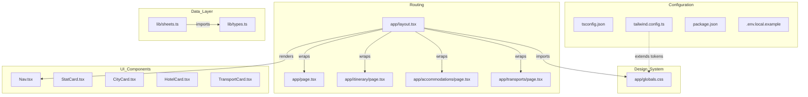

# Technical Design: project-setup

## Overview

This feature establishes the complete project scaffold for **ireland-trip** — a Next.js 14 (App Router) travel companion web application for an 18-day Ireland & UK trip. It produces a compile-clean, Vercel-deployable skeleton: configuration files, the CSS design system, typed domain stubs, and placeholder UI components. All subsequent feature specs build on this foundation without restructuring.

Target users are two travelers sharing a single Vercel URL. This phase has no user-facing functionality beyond a working development server. Its value is guaranteeing a type-safe, consistently styled foundation from the first commit.

No existing architecture is modified. This is a greenfield initialization.

### Goals
- `npm run dev` and `npm run build` pass on the initial scaffold.
- All CSS design-system tokens (brand palette, glassmorphism, city accents) defined as `:root` custom properties.
- Tailwind v3 RGB-channel pattern wired so opacity modifiers (`bg-primary/10`) work correctly.
- Placeholder TypeScript interfaces (no `any`) for all components and domain types.
- Zero-config Vercel deployment without a `vercel.json`.

### Non-Goals
- Google Sheets data integration (placeholder signatures only; implemented in a subsequent spec).
- Page content or component visual styling (pages render placeholder text only).
- Authentication, routing guards, i18n infrastructure, or client-side interactivity.

---

## Architecture

### Architecture Pattern & Boundary Map

Server-component-first, flat Next.js App Router application. The scaffold defines four independent layers:



**Architecture integration**:
- **Selected pattern**: Static SSR with ISR (1-hour revalidation). No client-side data fetching at this phase.
- **Domain boundaries**: Configuration, Design System, Routing, UI Components, and Data Layer are independently evolvable.
- **No `"use client"` directives** at this phase — all files are server components.
- **Steering compliance**: Credentials server-side only; colors exclusively via CSS variables; `@/` alias to `./src`.

### Technology Stack & Alignment

| Layer | Choice / Version | Role | Notes |
|-------|-----------------|------|-------|
| Framework | Next.js 14 — App Router | Routing, SSR, ISR | Bootstrapped via `create-next-app` |
| Language | TypeScript 5.x — strict mode | Type safety across all files | `moduleResolution: "bundler"` |
| Styling | Tailwind CSS v3 + CSS custom properties | Design-system tokens + layout utilities | RGB-channel pattern for opacity modifiers |
| Runtime | Node.js ≥ 18 | Dev and build server | Locked via `package.json` `engines` field |
| Hosting | Vercel | Zero-config deployment + ISR | Native Next.js detection; no `vercel.json` |

---

## Requirements Traceability

| Requirement | Summary | Component | Interface |
|-------------|---------|-----------|-----------|
| 1.1 | App Router + TS + Tailwind + src/ bootstrap | `package.json`, `tsconfig.json` | — |
| 1.2 | All source files under `src/` | Directory skeleton | — |
| 1.3, 2.3 | `@/` alias → `./src` | `tsconfig.json` | — |
| 1.4 | `npm run dev` starts without errors | All placeholder files | — |
| 1.5 | `"engines": { "node": ">=18" }` | `package.json` | — |
| 2.1 | `"strict": true` in tsconfig | `tsconfig.json` | — |
| 2.2 | `"moduleResolution": "bundler"` | `tsconfig.json` | — |
| 2.4 | Build exits non-zero on TS error | `tsconfig.json` + Next.js build | — |
| 3.1 | Brand color tokens + RGB channels in `:root` | `globals.css` | CSSTokens |
| 3.2 | City accent tokens `--c1`–`--c6` in `:root` | `globals.css` | CSSTokens |
| 3.3 | Background via two fixed `div` layers | `layout.tsx` | RootLayout |
| 3.4 | System font stack on `body` | `globals.css` | — |
| 3.5 | No hardcoded hex in components | All UI components | — |
| 4.1 | Tailwind `content` array covering `src/` | `tailwind.config.ts` | — |
| 4.2 | RGB-channel color extension in Tailwind | `tailwind.config.ts` | TailwindColors |
| 4.3 | Opacity modifiers work at runtime | `tailwind.config.ts` + `globals.css` | — |
| 4.4 | No override of default Tailwind scales | `tailwind.config.ts` | — |
| 5.1 | Full directory skeleton under `src/` | src/ structure | — |
| 5.2 | `layout.tsx`: bg layers + Nav + main | `layout.tsx` | RootLayout |
| 5.3 | Placeholder components compile, no `any` | All UI components + pages | ComponentProps |
| 5.4 | `globals.css` imported once at root | `layout.tsx` | — |
| 6.1 | `.env.local.example` with variable keys | `.env.local.example` | — |
| 6.2 | `.env.local` in `.gitignore` | `.gitignore` | — |
| 6.3 | Build succeeds without env vars present | `sheets.ts` | SheetsService |
| 6.4 | `sheets.ts` returns `[]` on any failure | `sheets.ts` | SheetsService |
| 7.1 | No `vercel.json` committed | — (omitted) | — |
| 7.2 | ISR via `next: { revalidate: 3600 }` in fetch | `sheets.ts` | SheetsService |
| 7.3 | Zero-config Vercel deploy via `npm run build` | `package.json` scripts | — |
| 7.4 | Future `vercel.json` guidance documented | `sheets.ts` comments | — |

---

## Components and Interfaces

### Summary

| Component | Layer | Intent | Requirements | Key Dependencies | Contracts |
|-----------|-------|--------|--------------|-----------------|-----------|
| `tsconfig.json` | Configuration | Strict mode + path alias + bundler resolution | 1.3, 2.1, 2.2, 2.3, 2.4 | Next.js 14 | — |
| `tailwind.config.ts` | Configuration | Content array + RGB-channel color extension | 4.1, 4.2, 4.3, 4.4 | Tailwind v3 | TailwindColors |
| `package.json` | Configuration | Scripts + Node.js ≥18 engine lock | 1.1, 1.4, 1.5, 7.3 | Node.js ≥18 | — |
| `.env.local.example` | Configuration | Env var template, safe to commit | 6.1, 6.2 | — | — |
| `globals.css` | Design System | All `:root` CSS custom properties | 3.1, 3.2, 3.4 | — | CSSTokens |
| `layout.tsx` | Routing | Root layout: bg layers + Nav + children | 3.3, 5.2, 5.4 | Nav, globals.css | RootLayout |
| `lib/types.ts` | Data Layer | Domain type stubs: City, Hotel, Transport | 2.1, 5.3 | — | DomainTypes |
| `lib/sheets.ts` | Data Layer | Sheets client stubs with error-fallback + ISR | 6.3, 6.4, 7.2 | types.ts | SheetsService |
| `Nav.tsx` | UI | Navigation placeholder | 5.3 | — | NavProps |
| `StatCard.tsx` | UI | Stat card placeholder | 5.3 | — | StatCardProps |
| `CityCard.tsx` | UI | City timeline card placeholder | 5.3 | — | CityCardProps |
| `HotelCard.tsx` | UI | Hotel card placeholder | 5.3 | — | HotelCardProps |
| `TransportCard.tsx` | UI | Transport card placeholder | 5.3 | — | TransportCardProps |
| Pages (×4) | Routing | Placeholder pages for all routes | 5.1, 5.3 | layout.tsx | — |

---

### Configuration Layer

#### tsconfig.json

| Field | Detail |
|-------|--------|
| Intent | TypeScript compiler configuration: strict mode, path alias, bundler module resolution |
| Requirements | 1.3, 2.1, 2.2, 2.3, 2.4 |

**Responsibilities & Constraints**
- `"strict": true` — enables all strict-mode checks (`noImplicitAny`, `strictNullChecks`, `strictFunctionTypes`, etc.).
- `"moduleResolution": "bundler"` — Next.js 14 recommended; avoids requiring `.js` extensions in relative imports.
- `"paths": { "@/*": ["./src/*"] }` with `"baseUrl": "."` — resolves `@/` at compile time.
- `"include"` covers `["next-env.d.ts", "**/*.ts", "**/*.tsx", ".next/types/**/*.ts"]`.

**Implementation Notes**
- `"moduleResolution": "node"` is incompatible with App Router's server/client component conventions — do not use.
- `"baseUrl": "."` is required alongside `"paths"`; without it TypeScript cannot resolve the alias.

---

#### tailwind.config.ts

| Field | Detail |
|-------|--------|
| Intent | Tailwind CSS configuration: content array covering `src/` + RGB-channel brand palette extension |
| Requirements | 4.1, 4.2, 4.3, 4.4 |

**Contracts**: State [x]

##### Tailwind Color Extension Contract

```typescript
// theme.extend.colors — only this section is customized
const colors: Record<string, string> = {
  primary:          'rgb(var(--primary-rgb) / <alpha-value>)',
  'primary-dark':   'rgb(var(--primary-dark-rgb) / <alpha-value>)',
  accent:           'rgb(var(--accent-rgb) / <alpha-value>)',
  success:          'rgb(var(--success-rgb) / <alpha-value>)',
  warning:          'rgb(var(--warning-rgb) / <alpha-value>)',
  dark:             'rgb(var(--dark-rgb) / <alpha-value>)',
  light:            'rgb(var(--light-rgb) / <alpha-value>)',
};

const content: string[] = [
  './src/app/**/*.{ts,tsx}',
  './src/components/**/*.{ts,tsx}',
  // src/lib/ is excluded: it contains only TypeScript logic and types, no Tailwind utility classes
];
```

**Implementation Notes**
- `<alpha-value>` is a Tailwind build-time placeholder; do not replace it with a literal value.
- CSS variables must hold **space-separated** channels (`108 92 231`), not comma-separated — comma syntax silently disables opacity modifiers.
- Spacing, typography, and responsive breakpoint scales are not overridden.
- City accent tokens (`--c1`–`--c6`) are **not** extended into Tailwind; they are used only via CSS `var()` in component styles.

---

### Design System Layer

#### globals.css

| Field | Detail |
|-------|--------|
| Intent | Single source of truth for all CSS custom properties: brand palette, RGB channels, glassmorphism tokens, city accents, and typography base |
| Requirements | 3.1, 3.2, 3.4 |

**Contracts**: State [x]

##### CSS Token Contract (`:root` custom properties)

| Token | Value | Role |
|-------|-------|------|
| `--primary` | `#6C5CE7` | Primary purple |
| `--primary-rgb` | `108 92 231` | Tailwind opacity support |
| `--primary-dark` | `#5A4BD1` | Hover state |
| `--primary-dark-rgb` | `90 75 209` | Tailwind opacity support |
| `--accent` | `#FF6B8A` | Pink accent |
| `--accent-rgb` | `255 107 138` | Tailwind opacity support |
| `--success` | `#00B894` | Confirmed / positive indicator |
| `--success-rgb` | `0 184 148` | Tailwind opacity support |
| `--warning` | `#FDCB6E` | Pending / stat numbers |
| `--warning-rgb` | `253 203 110` | Tailwind opacity support |
| `--dark` | `#2D3436` | Body text on white cards |
| `--dark-rgb` | `45 52 54` | Tailwind opacity support |
| `--light` | `#F5F6FA` | Card backgrounds |
| `--light-rgb` | `245 246 250` | Tailwind opacity support |
| `--glass` | `rgba(255,255,255,0.12)` | Glass panel fill |
| `--glass-border` | `rgba(255,255,255,0.25)` | Glass panel border |
| `--grad-start` | `#667eea` | Background gradient start |
| `--grad-end` | `#764ba2` | Background gradient end |
| `--c1` | `#6C5CE7` | Dublin (1st stay) accent |
| `--c2` | `#FF6B8A` | Belfast accent |
| `--c3` | `#00B894` | Edinburgh accent |
| `--c4` | `#0984E3` | Liverpool accent |
| `--c5` | `#D63031` | London accent |
| `--c6` | `#FDCB6E` | Dublin (2nd stay) accent |

**Body base styles** (also in `globals.css`):
```css
body {
  font-family: 'Segoe UI', Tahoma, Geneva, Verdana, sans-serif;
  margin: 0;
}
```

**Implementation Notes**
- `globals.css` is imported exclusively in `layout.tsx` via `import './globals.css'`. Never import it in individual page or component files.
- No web font imports — system font stack only.

---

### Routing Layer

#### layout.tsx

| Field | Detail |
|-------|--------|
| Intent | Root layout: imports the design system, renders two fixed background layers, wraps all pages with Nav and a main content area |
| Requirements | 3.3, 5.2, 5.4 |

**Responsibilities & Constraints**
- Imports `./globals.css` — the only import point for the design system in the entire application.
- Renders two `div` layers as the **first children of `<body>`**, before `<Nav />` and `<main>`:
  - Layer 1 (`z-index: -50`): `position: fixed; inset: 0; background: linear-gradient(135deg, var(--grad-start) 0%, var(--grad-end) 100%)`
  - Layer 2 (`z-index: -40`): `position: fixed; inset: 0; opacity: 0.04; pointer-events: none; background-image: url('/noise.svg')`
- `background-attachment: fixed` on `body` is **prohibited** — use these fixed `div` layers instead (iOS Safari scroll-repaint workaround; see `research.md`).

**Dependencies**
- Outbound: `Nav` component (P0)
- External: `./globals.css` — design-system tokens (P0)

**Contracts**: Service [x]

##### Root Layout Interface

```typescript
import type { Metadata } from 'next';

export const metadata: Metadata = {
  title: 'Ireland & UK Trip',
  description: 'Travel companion for an 18-day trip to Ireland and the United Kingdom',
};

export default function RootLayout(
  { children }: Readonly<{ children: React.ReactNode }>
): React.JSX.Element
```

- `<html lang="en">` wraps the full document.
- `<body>` sets no background styles of its own.
- The `metadata` export is consumed by Next.js App Router to populate `<title>` and `<meta name="description">` in the document `<head>` at build time.

---

### Data Layer

#### lib/types.ts

| Field | Detail |
|-------|--------|
| Intent | Domain type stub file; exports minimal placeholder interfaces for City, Hotel, Transport |
| Requirements | 2.1, 5.3 |

**Contracts**: State [x]

##### Domain Type Stubs

```typescript
// Populated in the data-layer spec; exported here so sheets.ts compiles without `any`
export interface City {
  id: string;
}

export interface Hotel {
  id: string;
}

export interface Transport {
  id: string;
}
```

- Single `id: string` field prevents `@typescript-eslint/no-empty-interface` warnings and provides a valid extension anchor for subsequent specs.

---

#### lib/sheets.ts

| Field | Detail |
|-------|--------|
| Intent | Google Sheets client placeholder: typed async functions with error-fallback boundary; ISR revalidation configured |
| Requirements | 6.3, 6.4, 7.2 |

**Responsibilities & Constraints**
- Exposes one async function per domain aggregate, each wrapping Sheets API calls in `try/catch`.
- On any error (missing credentials, network failure, rate limit) returns `[]` — never throws.
- `{ next: { revalidate: 3600 } }` is passed in each `fetch` call to enable 1-hour ISR on Vercel.
- Credentials (`GOOGLE_SHEETS_ID`, `GOOGLE_API_KEY`) consumed server-side only; never exposed to client components.

**Dependencies**
- Outbound: `types.ts` — domain interfaces (P0)
- External: Google Sheets REST API v4 — spreadsheet data (P1, runtime only; stub at this phase)

**Contracts**: Service [x]

##### SheetsService Interface

```typescript
import 'server-only'; // Build-time error if imported from a Client Component
import type { City, Hotel, Transport } from './types';

export async function getCities(): Promise<City[]>;
export async function getHotels(): Promise<Hotel[]>;
export async function getTransports(): Promise<Transport[]>;
```

- **Preconditions**: `GOOGLE_SHEETS_ID` and `GOOGLE_API_KEY` may be absent; functions return `[]` gracefully.
- **Postconditions**: Always resolves to an array; never rejects.
- **Invariants**: No credentials appear in function return values or logs.

**Implementation Notes**
- At scaffold phase, each body is `try { return [] } catch { return [] }` — real fetch logic added in the data-layer spec.
- The `{ next: { revalidate: 3600 } }` option is included as a comment inside each stub so future implementers know the correct placement.
- **ISR strategy (architectural note):** The `{ next: { revalidate: 3600 } }` option is native to Next.js `fetch` and integrates seamlessly with the App Router cache. If the data-layer spec chooses the `googleapis` npm SDK instead, the native `fetch` cache is bypassed — revalidation must then be declared at the route segment level via `export const revalidate = 3600` in the page or layout file instead.
- If `vercel.json` becomes necessary (security headers, redirects), add it at that point — never preemptively (7.4).

---

### UI Components Layer

All five placeholder components follow the same structural contract. None introduce new boundaries at this phase; full implementations are added in subsequent specs.

##### Base Component Props

```typescript
// Nav.tsx — no props at scaffold phase
export interface NavProps {
  // Populated in the navigation spec
}

// StatCard.tsx
export interface StatCardProps {
  label: string;
  value: string | number;
}

// CityCard.tsx
export interface CityCardProps {
  cityIndex: 1 | 2 | 3 | 4 | 5 | 6; // maps to --c1 through --c6
  name: string;
}

// HotelCard.tsx
export interface HotelCardProps {
  name: string;
  confirmed: boolean;
}

// TransportCard.tsx
export interface TransportCardProps {
  operator: string;
  from: string;
  to: string;
}
```

Each component:
- Exports a default function accepting the typed props above.
- Returns a single `<div>` with the component name as a text node (placeholder).
- Contains no inline styles and no hardcoded hex values.
- Does not use `'use client'` — all are server components at this phase.

**Placeholder page files** (`app/page.tsx`, `app/itinerary/page.tsx`, `app/accommodations/page.tsx`, `app/transports/page.tsx`):
- Each exports a default async server component that returns a `<main>` with the route name as text.
- No data fetching calls at this phase.

---

## Data Models

### Domain Model

Three domain aggregates are introduced as stubs. Full field definitions are owned by the data-layer spec.

| Aggregate | Interface | Scaffold State |
|-----------|-----------|----------------|
| `City` | `lib/types.ts` | `{ id: string }` stub |
| `Hotel` | `lib/types.ts` | `{ id: string }` stub |
| `Transport` | `lib/types.ts` | `{ id: string }` stub |

No relationships, invariants, or domain events at this phase.

### Data Contracts & Integration

- **Read-only**: Google Sheets API key has no write permissions.
- **Server-side only**: `sheets.ts` is never imported from client components or passed as a prop.
- **ISR**: Data cached for 3600 seconds per route; no runtime cache invalidation.

---

## Error Handling

### Error Strategy

| Error | Source | Response |
|-------|--------|----------|
| Missing env vars at build time | CI / Vercel | Build succeeds; `sheets.ts` stubs return `[]` |
| Google Sheets API failure (runtime) | Network / rate limit | `try/catch` in `sheets.ts`; returns `[]`; page renders with empty state |
| TypeScript compile error | Developer | `npm run build` exits non-zero; error printed to stdout |
| Missing `public/noise.svg` | Missing asset | CSS `background-image` ignored silently; page renders without noise texture |

### Monitoring

No monitoring at scaffold phase. Sheets errors are swallowed silently at this stage. A future spec may introduce `console.error` logging or Sentry integration inside the `catch` block.

---

## Testing Strategy

### Unit Tests
- `sheets.ts`: Each function returns `[]` when env vars are absent (mock `process.env`; verify no throw).
- `types.ts`: Compile-time verification — `tsc --noEmit` passes with no errors.

### Integration Tests
- `npm run build` exits 0 on the clean scaffold with no `.env.local`.
- Introduce a deliberate type error in `src/app/page.tsx`; verify `npm run build` exits non-zero and prints the error.

### Deploy Tests
- Push to Vercel-connected repository; confirm automatic deployment completes with zero manual dashboard steps.
- Verify `npm run dev` starts without errors on a clean clone with no `.env.local` present.

---

## Security Considerations

- `GOOGLE_API_KEY` is consumed only in `lib/sheets.ts` (server component). It is never passed to client props, never prefixed with `NEXT_PUBLIC_`, and never returned from a server action or API route.
- `.env.local` is listed in `.gitignore`; only `.env.local.example` (no real values) is committed.
- No client-side API routes in this phase; no CORS or authentication surface to secure.
