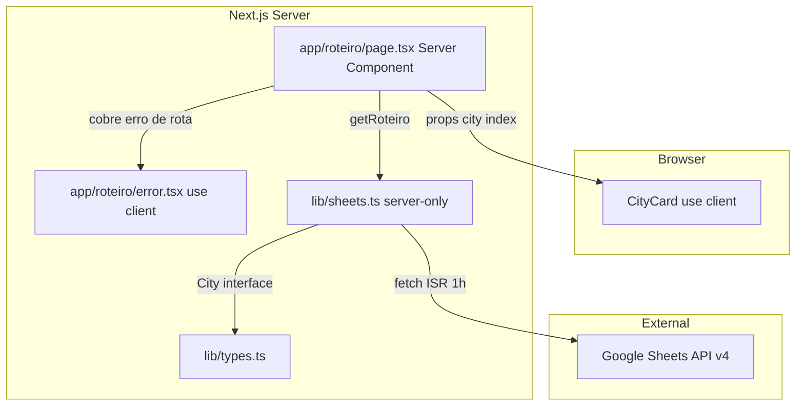
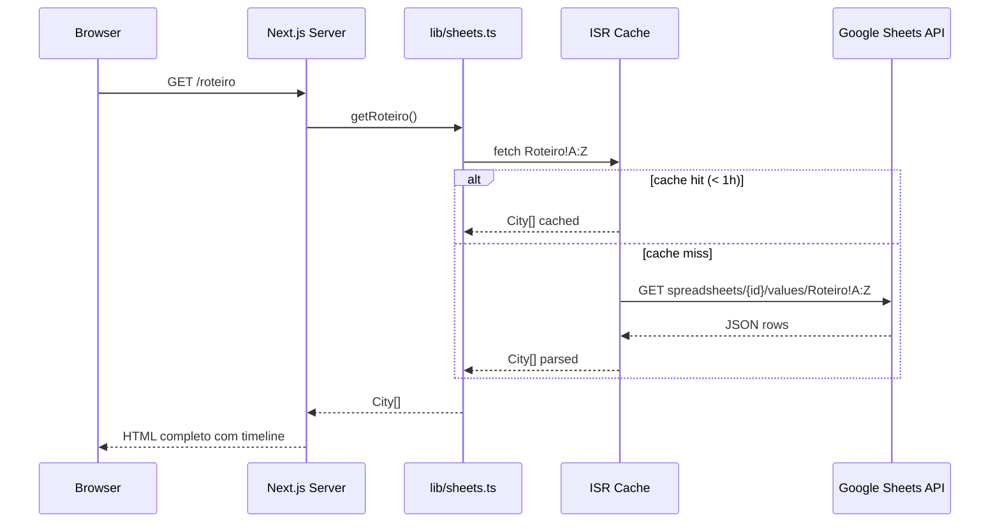
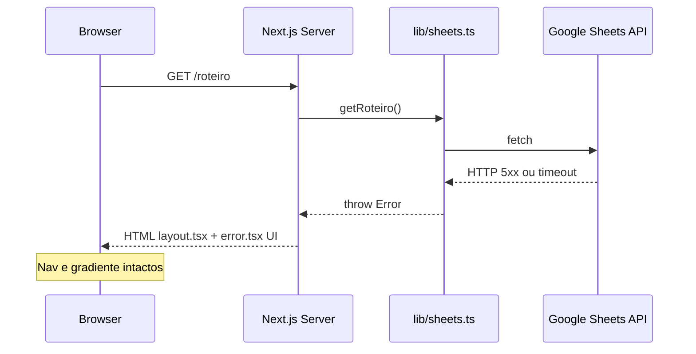

# Design Técnico — roteiro-page

## Visão Geral

A página `/roteiro` é o centro do aplicativo companion de viagem Irlanda & UK. Ela exibe uma timeline vertical interativa com cards expansíveis por cidade, consumindo dados server-side da aba `Roteiro` da planilha Google Sheets. Serve como referência de estilo para todas as outras páginas do projeto.

**Usuários**: Os dois viajantes, acessando via Vercel URL antes e durante a viagem.

**Impacto**: Introduz três novos arquivos (`app/roteiro/page.tsx`, `app/roteiro/error.tsx`, `components/CityCard.tsx`) sem modificar nenhum arquivo existente. Consome contratos já aprovados em `lib/types.ts` e `lib/sheets.ts`.

### Objetivos

- Timeline vertical com efeito zigzag no desktop e coluna única no mobile, sem lógica de layout nos componentes.
- `CityCard` expansível com estado local (`useState`), recebendo `City` + `index` como props serializáveis.
- Cores de acento atribuídas por índice cíclico `(index % 6) + 1`, sem hardcode de nomes de cidade.
- Zero chamadas à Sheets API no browser; Error Boundary mantém layout global funcional em caso de falha.

### Não-Objetivos

- Filtro ou ordenação de cidades pelo usuário.
- Edição de dados da planilha.
- Animações além de `fadeInUp` de entrada e transição de expansão.
- Revalidação sob demanda; ISR de 1h é suficiente.

---

## Arquitetura

### Padrão & Mapa de Fronteiras

Server Component padrão com uma única ilha cliente (`CityCard`). A fronteira `"use client"` é o menor escopo possível.



**Decisões-chave**:
- `page.tsx` é server component puro — sem `useState`, sem `"use client"`.
- `CityCard.tsx` é o único componente cliente; recebe `{ city: City; index: number; accentVar: string }` como props serializáveis.
- CSS Grid 3 colunas no container `<ol>` realiza o zigzag via `nth-child` — `CityCard` é agnóstico ao layout (ver `research.md`).
- `error.tsx` captura qualquer exceção lançada por `getRoteiro()`, preservando nav + gradiente do `layout.tsx` pai.

### Stack de Tecnologia

| Camada | Escolha | Papel | Notas |
|--------|---------|-------|-------|
| Framework | Next.js 14 App Router | SSR/ISR, roteamento, Error Boundary | `page.tsx` = server component padrão |
| Linguagem | TypeScript strict | Tipagem de props e contratos | Sem `any`; `City` de `lib/types.ts` |
| Styling | Tailwind CSS + CSS custom properties | Layout, responsividade, design system | Cores via `var(--c1)`–`var(--c6)` |
| Animação | CSS `@keyframes` + `animationDelay` inline | `fadeInUp` escalonado por índice | Sem bibliotecas JS de animação |
| Dados | `lib/sheets.ts` — `getRoteiro()` | Fetch server-side com ISR 1h | `server-only` guard |
| Tipos | `lib/types.ts` — `City` interface | Contrato de dados | `readonly` fields, `atividades: string[]` |

---

## Rastreabilidade de Requisitos

| Requisito | Resumo | Componentes | Contrato / Interface | Fluxo |
|-----------|--------|-------------|---------------------|-------|
| 1.1 | Fetch server-side via `getRoteiro()` | `page.tsx` | `SheetsClient.getRoteiro` | Fetch Flow |
| 1.2 | ISR 1h centralizado em `fetchSheetRange` | `lib/sheets.ts` | — | — |
| 1.3 | Error Boundary `error.tsx` preserva layout | `error.tsx` | `ErrorPageProps` | Error Flow |
| 1.4 | Mapeamento + higienização → `City[]` | `lib/sheets.ts` | `City` | — |
| 1.5 | `server-only` guard + zero props API no client | `lib/sheets.ts`, `page.tsx` | — | — |
| 2.1 | Renderização de N cidades da planilha | `page.tsx` | — | — |
| 2.2 | Zigzag via CSS Grid `nth-child` no desktop | `page.tsx` (container `<ol>`) | — | — |
| 2.3 | Conector visual (linha central) no CSS Grid | `page.tsx` (coluna central) | — | — |
| 2.4 | Cabeçalho com título + subtítulo de período | `page.tsx` | — | — |
| 2.5 | HTML gerado no servidor (SSR/ISR) | `page.tsx` | — | — |
| 2.6 | Total de cidades exibido no cabeçalho | `page.tsx` | — | — |
| 3.1 | Card fechado: emoji, nome, datas, noites, destaque | `CityCard` | `CityCardProps` | — |
| 3.2 | Borda esquerda `var(--cN)` por índice cíclico | `CityCard` | `CityCardProps.accentVar` | — |
| 3.3 | Estilo card branco com sombra e border-radius | `CityCard` | — | — |
| 3.4 | Hover lift `translateY(-4px)` + sombra | `CityCard` | — | — |
| 3.5 | Chevron indicando expansibilidade | `CityCard` | — | — |
| 3.6 | `fadeInUp` escalonado via `animationDelay` inline | `CityCard` | — | — |
| 4.1 | Toggle estado expandido/fechado por clique | `CityCard` | `useState<boolean>` | — |
| 4.2 | Detalhes expandidos: bairro, preço/noite, atividades | `CityCard` | — | — |
| 4.3 | Highlight bar com gradiente da cor de acento | `CityCard` | — | — |
| 4.4 | `"use client"` apenas em `CityCard` | `CityCard` | — | — |
| 4.5 | `max-height` CSS transition ~0.3s | `CityCard` | — | — |
| 4.6 | Expansão independente por card | `CityCard` (`useState` local) | — | — |
| 4.7 | `atividades` renderizado como badges/tags | `CityCard` | — | — |
| 5.1 | Cor cíclica `(index % 6) + 1` sem nome de cidade | `page.tsx` (cálculo) + `CityCard` (consumo) | `CityCardProps.accentVar` | — |
| 5.2 | Somente `var(--cN)` — sem hex hardcoded | `CityCard` | — | — |
| 5.3 | Gradiente de fundo herdado de `layout.tsx` | `layout.tsx` (existente) | — | — |
| 5.4 | Fonte do sistema, sem import externo | `globals.css` (existente) | — | — |
| 5.5 | Badges design system | `CityCard` | — | — |
| 5.6 | `max-width: 1000px` centralizado | `page.tsx` (container) | — | — |
| 6.1 | Timeline coluna única em `≤ 768px` | `page.tsx` + Tailwind breakpoints | — | — |
| 6.2 | Cards full-width em mobile | `CityCard` + Tailwind | — | — |
| 6.3 | Título `1.7rem` em `≤ 480px` | `page.tsx` + Tailwind | — | — |
| 6.4 | Nav bottom tab herdada de `layout.tsx` | `layout.tsx` (existente) | — | — |
| 6.5 | Área de toque mínima 44×44px | `CityCard` (botão header) | — | — |
| 6.6 | Sem overflow horizontal no conteúdo expandido | `CityCard` + Tailwind `overflow-hidden` | — | — |
| 7.1 | HTML semântico `<main>`, `<ol>`, `<li>`, headings | `page.tsx` + `CityCard` | — | — |
| 7.2 | `aria-expanded` booleano no botão do card | `CityCard` | — | — |
| 7.3 | Ativação por teclado (Enter/Espaço) | `CityCard` (`<button>` nativo) | — | — |
| 7.4 | `export const metadata` com title + description | `page.tsx` | `Metadata` (Next.js) | — |
| 7.5 | Contraste WCAG AA cards brancos vs gradiente | `CityCard` + design tokens | — | — |

---

## Fluxos do Sistema

### Fetch Flow (SSR/ISR)



### Error Flow



---

## Componentes e Interfaces

### Sumário

| Componente | Camada | Intenção | Requisitos | Dependências-chave | Contrato |
|------------|--------|----------|------------|-------------------|---------|
| `app/roteiro/page.tsx` | Routing / Server | Orquestra fetch + monta timeline | 1.1, 2.1–2.6, 5.1, 5.3, 5.6, 6.1–6.4, 7.1, 7.4 | `getRoteiro`, `CityCard`, `City` | Service |
| `app/roteiro/error.tsx` | Routing / Client | Error Boundary da rota | 1.3 | — | State |
| `components/CityCard.tsx` | UI / Client | Card expansível de cidade | 3.1–3.6, 4.1–4.7, 5.2, 5.5, 6.2, 6.5–6.6, 7.1–7.3, 7.5 | `City`, CSS tokens | State |

---

### Routing / Server

#### `app/roteiro/page.tsx`

| Campo | Detalhe |
|-------|---------|
| Intent | Server Component que busca `City[]`, calcula `accentVar` por índice cíclico e renderiza a timeline |
| Requirements | 1.1, 2.1–2.6, 5.1, 5.3, 5.6, 6.1–6.4, 7.1, 7.4 |

**Responsabilidades**
- Chamar `getRoteiro()` e receber `City[]` — nenhum estado ou efeito.
- Calcular `accentVar = \`--c${(index % 6) + 1}\`` para cada cidade e passá-lo como prop para `CityCard`.
- Renderizar container `<ol>` com CSS Grid 3 colunas para o zigzag desktop.
- Exportar `metadata` do Next.js com `title` e `description`.
- Exibir total de cidades no cabeçalho.

**Dependências**
- Outbound: `lib/sheets.ts` — `getRoteiro()` (P0)
- Outbound: `components/CityCard.tsx` — renderização de cada cidade (P0)
- Inbound: `app/layout.tsx` — fornece fundo, nav e `<main>` wrapper (P0)

**Contrato**: Service [x]

##### Service Interface

```typescript
// Metadados SEO — exportado no topo do módulo
export const metadata: Metadata = {
  title: 'Roteiro | Irlanda & UK 2026',
  description: 'Timeline completa da viagem — cidades, datas, destaques e atividades.',
};

// Assinatura da page (Next.js App Router — sem props de rota)
export default async function RoteiroPage(): Promise<JSX.Element>
```

- Pré-condição: `GOOGLE_SHEETS_ID` e `GOOGLE_API_KEY` disponíveis em `process.env` (validados em `lib/sheets.ts`).
- Pós-condição: Retorna JSX com `<ol>` contendo `cities.length` elementos `<CityCard>`.
- Invariante: Se `getRoteiro()` lançar exceção, Next.js redireciona para `error.tsx` — `page.tsx` nunca retorna HTML de erro.

**Notas de Implementação**
- Container `<ol>` usa CSS Grid: `grid-template-columns: 1fr 1fr` com colunas iguais; a linha conectora central é um pseudo-elemento `::before` no próprio `<ol>` com `position: absolute; left: 50%; transform: translateX(-50%); width: 2px; height: 100%`. Esta abordagem garante traço contínuo independente da altura individual dos cards — sem lacunas quando cards adjacentes têm alturas diferentes. Em mobile (`≤ 768px`), a linha passa para `left: 24px; transform: none`.
- `nth-child(odd)` → `grid-column: 1; justify-self: end`, `nth-child(even)` → `grid-column: 2; justify-self: start`. O `<ol>` precisa de `position: relative` para ancorar o pseudo-elemento.
- `max-w-[1000px] mx-auto px-6` no container externo para req 5.6.
- Título responsivo: `text-[clamp(1.7rem,4vw,2.5rem)]` ou `text-[1.7rem] sm:text-[2.5rem]`.

---

### Routing / Client

#### `app/roteiro/error.tsx`

| Campo | Detalhe |
|-------|---------|
| Intent | Error Boundary da rota `/roteiro` — exibe mensagem amigável sem expor stack trace |
| Requirements | 1.3 |

**Responsabilidades**
- Capturar qualquer `Error` lançado por `page.tsx` (incluindo falhas de `getRoteiro()`).
- Exibir UI de erro amigável em português com botão "Tentar novamente" que chama `reset()`.
- Não renderizar nenhum detalhe técnico do `error` recebido.

**Contrato**: State [x]

##### State Management

```typescript
'use client';

interface ErrorPageProps {
  readonly error: Error & { digest?: string };
  readonly reset: () => void;
}

export default function RoteiroError({ error, reset }: ErrorPageProps): JSX.Element
```

- Estado: nenhum estado local além do `error` e `reset` recebidos pelo Next.js.
- O componente é `"use client"` por requisito do Next.js App Router para Error Boundaries.

**Notas de Implementação**
- Card com mesmo estilo glassmorphism do restante do app.
- Não logar `error.message` no console em produção; usar apenas `error.digest` se disponível (opaco para o usuário).

---

### UI / Client

#### `components/CityCard.tsx`

| Campo | Detalhe |
|-------|---------|
| Intent | Card expansível de cidade — exibe resumo no estado fechado e detalhes completos no estado expandido |
| Requirements | 3.1–3.6, 4.1–4.7, 5.2, 5.5, 6.2, 6.5–6.6, 7.1–7.3, 7.5 |

**Responsabilidades**
- Manter estado booleano local `isExpanded` via `useState`.
- Renderizar header (sempre visível) e seção de detalhes (visível quando `isExpanded`).
- Aplicar borda esquerda, animação de entrada e highlight bar usando `accentVar` recebida como prop.
- Garantir acessibilidade: `<button>` nativo no header, `aria-expanded`, `aria-controls`, ativação por teclado; painel de detalhes com `id` e `role="region"` vinculados ao botão.

**Dependências**
- Inbound: `app/roteiro/page.tsx` — passa `city: City`, `index: number`, `accentVar: string` (P0).
- External: CSS custom properties `--c1`–`--c6`, `--primary`, `--success`, `--warning` em `globals.css` (P0).

**Contratos**: State [x]

##### Props Interface

```typescript
'use client';

import type { City } from '@/lib/types';

interface CityCardProps {
  readonly city: City;
  readonly index: number;
  readonly accentVar: string; // ex.: "--c1", "--c2" ... "--c6"
}

export default function CityCard({ city, index, accentVar }: CityCardProps): JSX.Element
```

##### State Management

```typescript
// Estado interno — expansão independente por instância (req 4.6)
const [isExpanded, setIsExpanded] = useState<boolean>(false);

// ID do painel — vincula aria-controls ao id do painel (req 7.2 / a11y)
const panelId = `panel-${index}`;

// Estilo de borda aplicado inline (CSS variable dinâmica)
const accentStyle = { borderLeftColor: `var(${accentVar})` } as React.CSSProperties;

// Delay de animação aplicado inline (req 3.6)
const animationStyle = { animationDelay: `${index * 0.1}s` } as React.CSSProperties;

// Uso no JSX:
// <button aria-expanded={isExpanded} aria-controls={panelId} ...>
// <div id={panelId} role="region" className={`grid transition-[grid-template-rows] ... ${isExpanded ? 'grid-rows-[1fr]' : 'grid-rows-[0fr]'}`}>
//   <div className="overflow-hidden">...</div>
// </div>
```

- Persistência: nenhuma — estado local reinicia em cada montagem.
- Concorrência: `useState` local por instância — sem conflito entre cards.
- `panelId` é estável por card (determinístico a partir de `index`) — sem geração aleatória.

**Notas de Implementação**
- Elemento raiz deve ser `<li>` (filho direto do `<ol>` em `page.tsx`) para que `nth-child` CSS funcione (req 2.2 — risco documentado em `research.md`).
- Header do card é um `<button>` nativo com `min-h-[44px]` para req 6.5; `onClick` chama `setIsExpanded(prev => !prev)`.
- Seção de detalhes usa o padrão **CSS Grid row expansion** para req 4.5 — elimina o "delay fantasma" do hack `max-height` com valor arbitrário: um `<div>` externo alterna entre `grid-rows-[0fr]` e `grid-rows-[1fr]` com `transition-[grid-template-rows] duration-300 ease-in-out`; o `<div>` interno filho tem `overflow-hidden`. A transição anima a altura real do conteúdo, sem easing assimétrico no fechamento.
- Highlight bar: `background: linear-gradient(90deg, var(accentVar), var(--c${(index % 6) + 2 > 6 ? 1 : (index % 6) + 2}))` — par adjacente de cores no pallete.
- Badges de atividades: `city.atividades.map(a => <span className="badge-primary" key={a}>{a}</span>)` — array já higienizado por `lib/sheets.ts`.
- `@keyframes fadeInUp` definido em `globals.css`; classe `animate-fade-in-up` ou `style={{ animation: '...' }}` inline.
- Contraste WCAG AA garantido pelo fundo branco dos cards e texto `var(--dark)` (#2D3436).

---

## Modelos de Dados

### Modelo de Domínio

`CityCard` consome a interface `City` definida em `lib/types.ts` sem modificação:

```typescript
// Contrato definido em lib/types.ts (spec typescript-types)
interface City {
  readonly cidade: string;
  readonly emoji: string;
  readonly data_entrada: string;   // "DD/MM"
  readonly data_saida: string;     // "DD/MM"
  readonly noites: number;
  readonly destaque: string;
  readonly bairro: string;
  readonly preco_noite: string;    // ex.: "€80-120"
  readonly atividades: readonly string[]; // já splitado e higienizado por sheets.ts
}
```

Invariantes consumidos pela página:
- `atividades` é sempre um array (possivelmente vazio) — nunca `undefined`.
- `noites` é `number` — exibido diretamente sem conversão.
- Campos de string podem ser string vazia — `CityCard` renderiza fallback (`"—"`) se necessário.

---

## Tratamento de Erros

### Estratégia

| Categoria | Origem | Tratamento | Componente |
|-----------|--------|-----------|------------|
| Falha da Sheets API (HTTP 5xx, timeout) | `lib/sheets.ts` lança `Error` | Next.js captura → `error.tsx` renderiza UI amigável | `error.tsx` |
| Credenciais ausentes | `lib/sheets.ts` lança no módulo scope | Mesmo fluxo → `error.tsx` | `error.tsx` |
| Campo vazio na planilha | `lib/sheets.ts` higieniza → string vazia | `CityCard` renderiza fallback `"—"` | `CityCard` |
| `atividades` vazio | `lib/sheets.ts` → array vazio | `CityCard` renderiza lista vazia sem erro | `CityCard` |

- Nenhuma lógica de retry no cliente — ISR de 1h é a estratégia de resiliência.
- `error.tsx` expõe botão "Tentar novamente" (`reset()`) que força re-render da rota.

---

## Estratégia de Testes

### Testes Unitários

- `CityCard` renderiza estado fechado com os campos corretos (`cidade`, `emoji`, `noites`, `destaque`).
- `CityCard` alterna `isExpanded` ao clicar no botão header.
- `CityCard` renderiza `aria-expanded="false"` quando fechado e `"true"` quando aberto.
- Cálculo de `accentVar`: `(index % 6) + 1` retorna 1–6 para índices 0–5, e reinicia ciclicamente.
- `CityCard` com `atividades: []` não lança erro e renderiza lista vazia.

### Testes de Integração

- `RoteiroPage` com mock de `getRoteiro()` retornando `City[]`: renderiza `<ol>` com N `<li>` elementos.
- `RoteiroPage` com mock de `getRoteiro()` lançando erro: Next.js Test Utils confirma que `error.tsx` é ativado.
- `CityCard` com `city.atividades = ['a', 'b', 'c']` renderiza 3 badges.

### Testes E2E / UI

- Acesso à `/roteiro`: timeline visível com todos os cards no estado fechado.
- Clique no card de Dublin: expande e exibe bairro, preço/noite e atividades.
- Clique no mesmo card: fecha, seção de detalhes some.
- Dois cards expandidos simultaneamente: ambos permanecem expandidos independentemente.
- Viewport 375px: cards full-width, layout coluna única, sem overflow horizontal.
- Navegação via teclado (Tab + Enter): expande/fecha corretamente.

---

## Considerações de Segurança

- `lib/sheets.ts` tem `import 'server-only'` — impede inclusão no bundle do browser em qualquer cenário.
- `page.tsx` não serializa `process.env` como prop — `GOOGLE_API_KEY` jamais alcança o cliente.
- `error.tsx` não exibe `error.message` ao usuário — sem vazamento de informação de infraestrutura.

---

## Performance & Escalabilidade

- ISR 1h: máximo 1 requisição à Sheets API a cada hora por região Vercel Edge, independente do volume de acessos.
- Animação `fadeInUp` via CSS puro — zero JavaScript de animação no bundle.
- `CityCard` com `max-height` CSS: nenhuma leitura de DOM ou `ResizeObserver` — impacto zero no thread principal.
