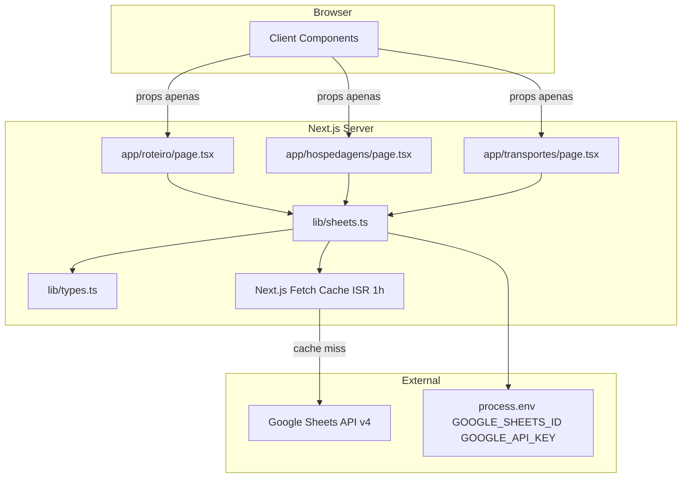
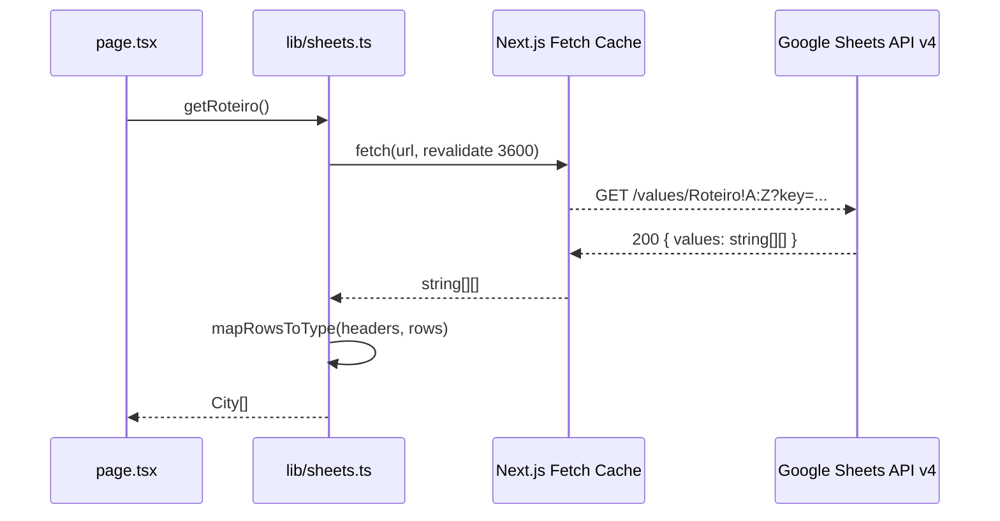
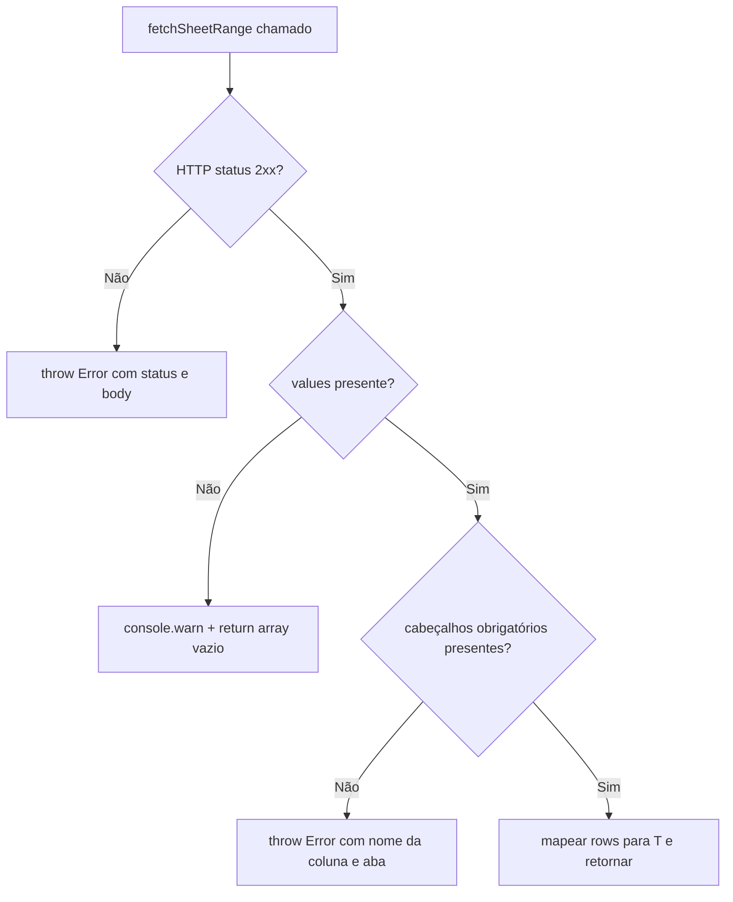

# Design Document — sheets-client

## Overview

O `sheets-client` é o módulo de acesso a dados da aplicação Euro 2026. Ele encapsula toda a comunicação com a Google Sheets API v4 em um único arquivo TypeScript server-side (`lib/sheets.ts`), expondo três funções assíncronas tipadas — uma por aba da planilha — que são consumidas exclusivamente pelos Server Components do Next.js.

**Purpose**: Centralizar fetch, cache ISR, transformação de dados e validação de credenciais em um único lugar, eliminando lógica de acesso a dados dos componentes de UI.

**Users**: Server Components (`app/roteiro/page.tsx`, `app/hospedagens/page.tsx`, `app/transportes/page.tsx`) e o layout raiz.

**Impact**: Introduz a camada `lib/` no projeto; sem impacto em componentes existentes.

### Goals

- Expor três funções tipadas (`getRoteiro`, `getHospedagens`, `getTransportes`) com retornos `City[]`, `Hotel[]`, `Transport[]`.
- Garantir que `GOOGLE_API_KEY` nunca alcance o bundle do browser via `server-only`.
- Implementar ISR de 1 hora em ponto único (`fetchSheetRange`).
- Falhar de forma descritiva em ausência de credenciais, erro HTTP ou coluna obrigatória ausente.

### Non-Goals

- Escrita na planilha (somente leitura).
- Cache em camadas além do `fetch` nativo do Next.js.
- Suporte a autenticação OAuth — API Key é suficiente para planilhas públicas/restritas por domínio.
- Revalidação sob demanda (`revalidatePath`/`revalidateTag`).

---

## Requirements Traceability

| Req | Resumo | Componente | Interface | Fluxo |
|-----|--------|------------|-----------|-------|
| 1.1–1.4 | Credenciais via `process.env`, validação fail-fast no módulo | `SheetsModule` | — | Módulo scope |
| 2.1–2.6 | Helper privado `fetchSheetRange` + 3 funções públicas | `SheetsModule` | `SheetsClient` | Fetch Flow |
| 3.1–3.4 | `import 'server-only'`, sem `"use client"`, key fora do bundle | `SheetsModule` | — | — |
| 4.1–4.4 | `revalidate: 3600` centralizado em `fetchSheetRange` | `SheetsModule` | — | — |
| 5.1–5.6 | Mapeamento por cabeçalho, erro descritivo, tipos de `lib/types.ts` | `SheetsModule` | `RowMapper<T>` | — |
| 6.1–6.4 | HTTP ≠ 2xx lança erro, `values` ausente → warn + `[]` | `SheetsModule` | — | Error Flow |

---

## Architecture

### Architecture Pattern & Boundary Map



**Key decisions**:
- `server-only` impede qualquer importação pelo bundle do browser — a boundary é estática/compilada, não runtime.
- `fetchSheetRange` é o único ponto de contato com a rede; as funções públicas apenas orquestram mapeamento.
- `lib/types.ts` é a fonte única de verdade para domínio — `sheets.ts` importa, não redefine.

### Technology Stack

| Camada | Escolha | Papel |
|--------|---------|-------|
| Runtime | Node.js 18+ (Next.js server) | Executa o módulo; provê `process.env` e `fetch` nativo |
| Framework | Next.js 14 App Router | ISR via `fetch` com `{ next: { revalidate } }` |
| Segurança | `server-only` npm package | Build-time guard — impede inclusão no bundle do browser |
| Tipagem | TypeScript strict | Contratos de retorno e mapeamento sem `any` |
| API externa | Google Sheets API v4 REST | Fonte de dados — endpoint `values.get` |

---

## System Flows

### Fetch Flow (cache miss)



### Error Flow



---

## Components and Interfaces

### Resumo

| Componente | Camada | Intenção | Req | Dependências-chave |
|------------|--------|----------|-----|---------------------|
| `SheetsModule` (`lib/sheets.ts`) | Data / Lib | Fetch, cache, transformação e validação de dados da planilha | 1–6 | `server-only` (P0), `lib/types.ts` (P0), `process.env` (P0) |

---

### Data Layer

#### SheetsModule

| Campo | Detalhe |
|-------|---------|
| Intent | Módulo server-side que centraliza acesso à Google Sheets API v4 |
| Requirements | 1.1, 1.2, 1.3, 1.4, 2.1, 2.2, 2.3, 2.4, 2.5, 2.6, 3.1, 3.2, 3.3, 3.4, 4.1, 4.2, 4.3, 4.4, 5.1, 5.2, 5.3, 5.4, 5.5, 5.6, 6.1, 6.2, 6.3, 6.4 |

**Responsibilities & Constraints**

- Único ponto de acesso à Sheets API — nenhuma `page.tsx` chama `fetch` diretamente para o Google.
- Valida variáveis de ambiente no escopo de módulo (pré-função), falha imediatamente se ausentes.
- Mapeia `string[][]` para tipos de domínio usando o nome do cabeçalho como chave.
- Nunca expõe `GOOGLE_API_KEY` em qualquer export ou valor serializável.

**Dependencies**

- External: `server-only` — guard de build para execução server-side (P0)
- External: Google Sheets API v4 REST — fonte de dados (P0)
- Internal: `lib/types.ts` — `City`, `Hotel`, `Transport` (P0)
- Runtime: `process.env.GOOGLE_SHEETS_ID`, `process.env.GOOGLE_API_KEY` (P0)

**Contracts**: Service [x] / API [ ] / Event [ ] / Batch [ ] / State [ ]

##### Service Interface

```typescript
// Funções públicas exportadas
export async function getRoteiro(): Promise<City[]>
export async function getHospedagens(): Promise<Hotel[]>
export async function getTransportes(): Promise<Transport[]>

// Helper privado (não exportado)
async function fetchSheetRange(range: string): Promise<string[][]>

// Mapper privado (não exportado)
function mapRowsToType<T>(
  tabName: string,
  requiredHeaders: (keyof T & string)[],
  rows: string[][]
): T[]
```

- **Preconditions**: `GOOGLE_SHEETS_ID` e `GOOGLE_API_KEY` definidas em `process.env`; planilha acessível com a key fornecida.
- **Postconditions**: Retorna array tipado (possivelmente vazio se planilha não tiver dados); nunca retorna `undefined` nem `null`.
- **Invariants**: `fetchSheetRange` sempre configura `{ next: { revalidate: 3600 } }`; `mapRowsToType` trata linha 0 como cabeçalho e linhas 1..N como dados.

**Implementation Notes**

- `server-only` deve ser o **primeiro** import do arquivo, antes de qualquer outro.
- Validação de env: executada no escopo de módulo, mas protegida pela variável `NEXT_PHASE` para não bloquear o `next build` em ambientes de CI que injetam segredos apenas em runtime:
  ```
  if (!process.env.GOOGLE_SHEETS_ID && process.env.NEXT_PHASE !== 'phase-production-build') {
    throw new Error("GOOGLE_SHEETS_ID não definida")
  }
  ```
  Isso preserva o fail-fast em runtime (servidor Vercel, dev local) sem quebrar pipelines de build que não expõem as variáveis na etapa de compilação.
- `fetchSheetRange` lança `Error` se `response.ok === false`, incluindo `response.status` e texto do body.
- `mapRowsToType` usa `headers.indexOf(col)` para localizar cada coluna obrigatória; lança `Error` descritivo se `indexOf` retornar `-1`. O acesso ao valor de cada célula usa coalescência nula para blindar o truncamento de linhas da API: `const value = row[colIndex] ?? ""` — a Google Sheets API omite células vazias no final de uma linha em vez de enviar strings vazias.
- Campos numéricos são convertidos com `Number(raw) || 0`; componentes de UI nunca fazem parsing.
- Risco: testes unitários requerem `process.env` configurado ou `NEXT_PHASE=phase-production-build` para ignorar a validação — documentar no README de testes.

---

## Data Models

### Domain Model

Os tipos de domínio vivem exclusivamente em `lib/types.ts`. O `sheets-client` consome, não define.

```typescript
// Contratos esperados em lib/types.ts (referência)
interface City {
  cidade: string; emoji: string; data_entrada: string; data_saida: string;
  noites: number; destaque: string; bairro: string; preco_noite: number; atividades: string;
}

interface Hotel {
  cidade: string; nome_hotel: string; data_checkin: string; data_checkout: string;
  noites: number; preco_total: number; moeda: string; status: string;
  endereco: string; link_booking: string; observacoes: string;
}

interface Transport {
  tipo: string; emoji: string; origem: string; destino: string;
  data: string; horario: string; duracao: string; operadora: string;
  status: string; preco: number; moeda: string; observacoes: string;
}
```

**Invariant**: Campos que representam quantidades numéricas (`noites`, `preco_total`, `preco`, `preco_noite`) são tipados como `number`. Campos textuais e de formatação variável (datas, moeda, status) permanecem `string`. A conversão de `string` para `number` ocorre exclusivamente em `mapRowsToType` via `Number(raw) || 0` — os componentes de UI nunca fazem parsing.

### Data Contracts & Integration

**Google Sheets API v4 — Contrato de Resposta**

| Campo | Tipo | Descrição |
|-------|------|-----------|
| `range` | `string` | Range efetivamente retornado (ex.: `Roteiro!A1:I10`) |
| `majorDimension` | `"ROWS"` | Sempre `ROWS` nesta implementação |
| `values` | `string[][]` | Linhas; linha 0 = cabeçalhos. Ausente se aba vazia. |

**URL pattern**: `https://sheets.googleapis.com/v4/spreadsheets/{SHEETS_ID}/values/{range}?key={API_KEY}`

---

## Error Handling

### Error Categories and Responses

| Cenário | Tipo | Comportamento |
|---------|------|---------------|
| Variável de env ausente | Inicialização do módulo | `throw new Error("GOOGLE_SHEETS_ID não definida")` |
| HTTP ≠ 2xx da Sheets API | Sistema (4xx/5xx externo) | `throw new Error("Sheets API error: {status} {body}")` |
| Falha de rede / timeout | Sistema | Propaga o erro original sem captura |
| `values` ausente na resposta | Aviso operacional | `console.warn("[sheets-client] Aba '{tabName}' retornou sem dados")` + `return []` |
| Coluna obrigatória ausente | Configuração / planilha | `throw new Error("Coluna '{col}' não encontrada na aba '{tabName}'")` |

### Monitoring

- `console.warn` em planilha vazia é suficiente para ambiente de produção Vercel (logs visíveis no dashboard).
- Erros de credencial e HTTP quebram o build/render — surfaced automaticamente pelo Next.js error boundary.

---

## Testing Strategy

### Unit Tests (`lib/sheets.test.ts`)

- `fetchSheetRange`: mock `global.fetch` — verifica URL construída, opção `revalidate`, lança em HTTP 4xx/5xx.
- `mapRowsToType`: testa mapeamento correto, erro em coluna faltante, array vazio para `values` ausente.
- Validação de env: setar/unset `process.env` antes do import; verificar `Error` descritivo.

### Integration Tests

- `getRoteiro` / `getHospedagens` / `getTransportes` com mock de `fetch` retornando fixture de `string[][]` — valida tipo de retorno e mapeamento ponta-a-ponta.
- Caso de planilha vazia (`values` ausente): confirma `[]` + `console.warn` chamado.

### Security Tests

- Verificar que `GOOGLE_API_KEY` não aparece em nenhum export ou na saída serializada dos dados retornados.
- Importar `lib/sheets.ts` em um arquivo com `"use client"` e confirmar que o build falha (teste de build).

---

## Security Considerations

- **`server-only`** garante que o módulo nunca seja incluído no bundle do browser — proteção estática em tempo de build.
- **Variáveis sem prefixo `NEXT_PUBLIC_`**: `GOOGLE_API_KEY` e `GOOGLE_SHEETS_ID` jamais são expostas ao cliente pelo Next.js.
- **Restrição de referrer HTTP** na Google Cloud Console é a segunda linha de defesa (fora do escopo deste módulo, mas documentada nos requisitos de deploy).
