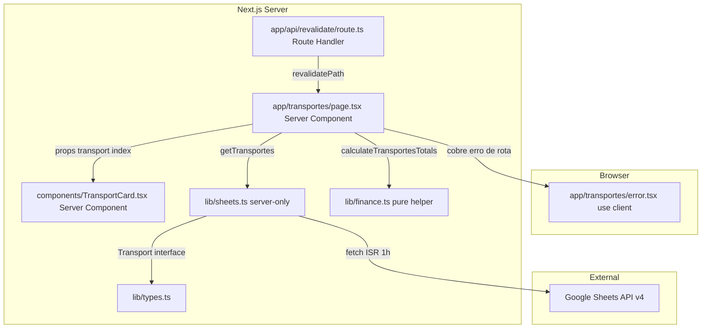
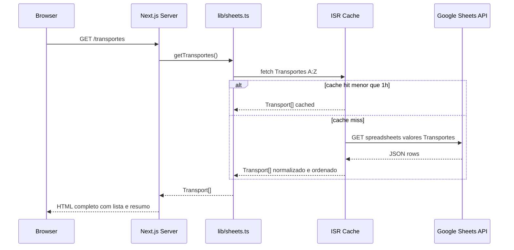
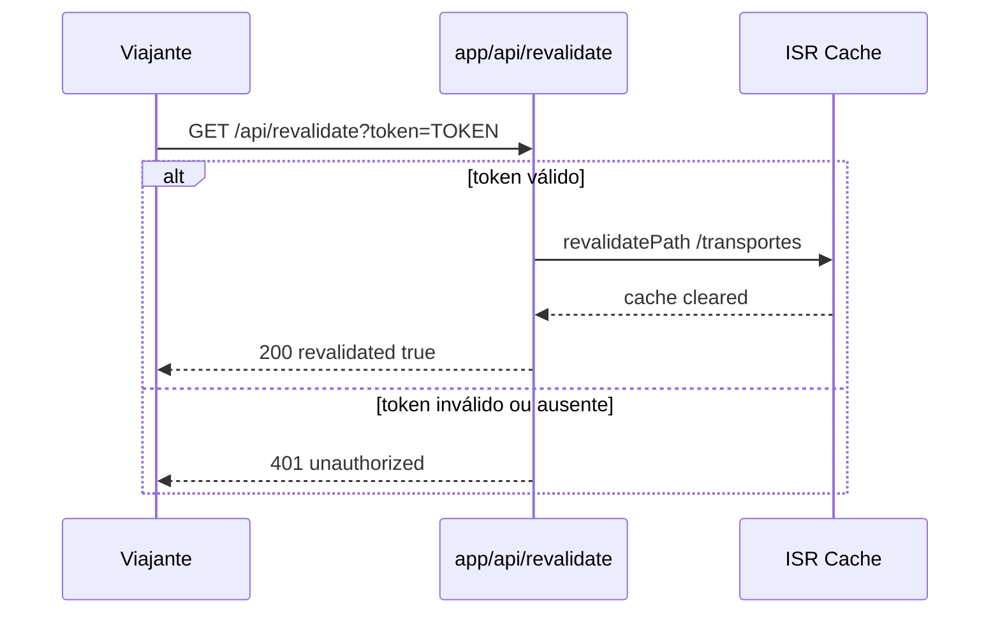

# Design Técnico — transportes-page

## Visão Geral

A página `/transportes` é o log de trechos da viagem Irlanda & UK 2026. Busca dados server-side da aba `Transportes` do Google Sheets, normaliza e ordena cronologicamente, e renderiza uma lista vertical de `TransportCard`s com badge de status de pagamento e glass panel de resumo financeiro.

**Usuários**: Os dois viajantes, acessando via URL Vercel antes e durante a viagem.

**Impacto**: Cria `app/transportes/page.tsx`, `app/transportes/error.tsx`, `components/TransportCard.tsx`, `app/api/revalidate/route.ts`. Estende `lib/sheets.ts` com `getTransportes()` e `lib/finance.ts` com `calculateTransportesTotals()`. Adiciona `Transport` e tipos auxiliares a `lib/types.ts`.

### Objetivos

- Rota `/transportes` funcional, consistente com `Nav.tsx`.
- Lista vertical única, ordenada cronologicamente por `data` normalizado para ISO 8601.
- `TransportCard` Server Component puro: hover horizontal via CSS `transition` sem `"use client"`.
- `export const revalidate = 3600` em `page.tsx` com `fetch` nativo em `lib/sheets.ts` para ISR coerente.
- Rota `app/api/revalidate/route.ts` para atualização imediata da planilha durante a viagem.
- `animation-delay` com teto de `0.5s` para listas com mais de 6 trechos.

### Não-Objetivos

- Filtro ou ordenação pelo usuário.
- Conversão automática de moedas.
- Mapa de rotas geográfico.
- Animações além de `fadeInUp` de entrada.

---

## Arquitetura

### Análise da Arquitetura Existente

- `lib/sheets.ts` já exporta `fetchSheetRange`, `getRoteiro`, `getHospedagens` — `getTransportes` segue o mesmo contrato.
- `lib/finance.ts` já existe com `calculateHospedagensTotals` — estendido com `calculateTransportesTotals` (não duplicado).
- `lib/types.ts` já define `City`, `Hotel`, `HotelStatus`, `Currency` — adiciona `Transport`, `TransportType`, `PaymentStatus`.
- Padrão de `app/hospedagens/error.tsx` (`"use client"` + `ErrorPageProps`) é reusado diretamente.
- `Nav.tsx` já aponta para `/transportes` — nenhuma alteração necessária.

### Padrão & Mapa de Fronteiras

Server Components por padrão. `error.tsx` é o único arquivo com `"use client"` (exigido pelo Next.js para Error Boundaries). Route Handler de revalidação é server-only.



**Decisões-chave**:
- `TransportCard` é Server Component puro — hover via `hover:translate-x-1 transition-transform duration-300`, sem JavaScript de interação.
- `data` normalizado para ISO 8601 em `getTransportes` antes de retornar; `Array.sort` usa `localeCompare` sobre strings ISO — sem instâncias `Date`.
- `calculateTransportesTotals` em `lib/finance.ts` (extensão do arquivo existente) — helper puro, testável sem Next.js.
- Rota de revalidação usa `crypto.timingSafeEqual` para comparação de token (ver `research.md` §2).

### Stack de Tecnologia

| Camada | Escolha / Versão | Papel | Notas |
|--------|-----------------|-------|-------|
| Framework | Next.js 14 App Router | SSR/ISR, roteamento, Error Boundary, Route Handler | `revalidate = 3600` em `page.tsx`; `revalidatePath` em rota de revalidação |
| Linguagem | TypeScript strict | Tipagem de props e contratos | Sem `any`; `Transport`, `TransportType`, `PaymentStatus` de `lib/types.ts` |
| Styling | Tailwind CSS + CSS custom properties | Layout e design system | Lista `flex flex-col gap-4`; hover via `hover:translate-x-1`; cores via `var(--)` |
| Animação | CSS `@keyframes fadeInUp` + `animationDelay` inline | Entrada escalonada com teto `0.5s` | `Math.min(index, 5) * 0.1s`; definido em `globals.css` (existente) |
| Dados | `lib/sheets.ts` — `getTransportes()` | Fetch server-side + normalização + ordenação | `server-only` guard; normalização de `data`, `preco`, `status` |
| Formatação | `Intl.NumberFormat` nativo | Formatação monetária | Locale `pt-BR`; sem dependência externa |
| Segurança | `crypto.timingSafeEqual` (Node.js built-in) | Comparação de token de revalidação | Evita timing attack; sem dependência adicional |

---

## Fluxos do Sistema

### Fetch Flow (SSR/ISR)



### Revalidação sob Demanda



---

## Rastreabilidade de Requisitos

| Req | Resumo | Componentes | Contrato | Fluxo |
|-----|--------|-------------|---------|-------|
| 1.1 | Fetch `Transportes!A:Z` server-side | `page.tsx` | `SheetsClient.getTransportes` | Fetch Flow |
| 1.2 | `fetch` nativo com `{ next: { revalidate: 3600 } }` em `lib/sheets.ts` | `lib/sheets.ts` | — | — |
| 1.3 | `export const revalidate = 3600` em `page.tsx` | `page.tsx` | — | — |
| 1.4 | Credenciais nunca no bundle cliente | `lib/sheets.ts`, `page.tsx` | — | — |
| 1.5 | Retorno tipado `Transport[]` | `lib/sheets.ts` | `Transport` | — |
| 1.6 | Error Boundary preserva layout | `error.tsx` | `ErrorPageProps` | Error Flow |
| 1.7 | Normalização: `data` → ISO 8601; `preco` → `number`; `status` → `.trim().toLowerCase()` | `lib/sheets.ts` — `getTransportes` | `Transport` | — |
| 1.8 | Linhas inválidas descartadas silenciosamente | `lib/sheets.ts` — `getTransportes` | — | — |
| 2.1 | Ordenação cronológica por `data` ISO | `page.tsx` | — | — |
| 2.2 | Lista vertical única, coluna única | `page.tsx` | — | — |
| 2.3 | Cabeçalho com título e total de trechos | `page.tsx` | — | — |
| 2.4 | Um `TransportCard` por registro | `page.tsx` | `TransportCardProps` | — |
| 2.5 | Gap consistente Tailwind entre cards | `page.tsx` | — | — |
| 2.6 | Full-width mobile / max 1000px desktop | `page.tsx` | — | — |
| 3.1–3.8 | Campos do card (emoji, rota, operadora, data, horário, duração, obs, preço) | `TransportCard` | `TransportCardProps` | — |
| 3.9 | Props tipada como `Transport` sem `any` | `TransportCard` | `TransportCardProps` | — |
| 4.1–4.4 | Badge roxo/âmbar por `status` | `TransportCard` | — | — |
| 5.1–5.5 | Seção de resumo glass panel com totais por moeda | `page.tsx` | `TotalsByMoeda` | — |
| 6.1 | Background gradiente herdado de `layout.tsx` | `layout.tsx` (existente) | — | — |
| 6.2 | `bg-white/80 backdrop-blur-md` nos cards | `TransportCard` | — | — |
| 6.3 | Top stripe roxo→rosa | `TransportCard` | — | — |
| 6.4 | Hover `translateX(4px)` CSS puro | `TransportCard` | — | — |
| 6.5 | `fadeInUp` + `animationDelay` com teto `0.5s` | `TransportCard` | — | — |
| 6.6–6.8 | CSS custom properties; tipografia; glass panel no resumo | `page.tsx`, `TransportCard` | — | — |
| 7.1–7.4 | Rota de revalidação com token, `revalidatePath`, HTTP 401 | `RevalidateRoute` | `RevalidateRouteAPI` | Revalidação sob Demanda |

---

## Componentes e Interfaces

### Sumário

| Componente | Camada | Intenção | Requisitos | Dependências-chave | Contrato |
|------------|--------|----------|------------|-------------------|---------|
| `app/transportes/page.tsx` | Routing / Server | Orquestra fetch, ordena, delega totais, renderiza lista + resumo | 1.1–1.4, 2.1–2.6, 5.1–5.5, 6.1, 6.6–6.8 | `getTransportes`, `calculateTransportesTotals`, `TransportCard` | Service |
| `app/transportes/error.tsx` | Routing / Client | Error Boundary da rota `/transportes` | 1.6 | — | State |
| `components/TransportCard.tsx` | UI / Server | Exibe campos + badge de status + top stripe; hover horizontal CSS | 3.1–3.9, 4.1–4.4, 6.2–6.5 | `Transport`, CSS tokens | Service |
| `lib/sheets.ts` — `getTransportes` | Data / Server | Fetch + normalização (data ISO, preco, status) + retorno `Transport[]` | 1.2, 1.5, 1.7, 1.8 | `fetchSheetRange`, `Transport` | Service |
| `lib/finance.ts` — `calculateTransportesTotals` | Logic / Pure | Helper puro — agrupa `preco` por `moeda` | 5.1–5.5 | `Transport`, `TotalsByMoeda` | Service |
| `app/api/revalidate/route.ts` | API / Server | Route Handler protegido por token — dispara `revalidatePath('/transportes')` | 7.1–7.4 | `next/cache`, `crypto` | API |

---

### Routing / Server

#### `app/transportes/page.tsx`

| Campo | Detalhe |
|-------|---------|
| Intent | Server Component que busca `Transport[]`, ordena cronologicamente, calcula totais e renderiza lista + glass panel de resumo |
| Requirements | 1.1–1.4, 2.1–2.6, 5.1–5.5, 6.1, 6.6–6.8 |

**Responsabilidades**
- Chamar `getTransportes()` — nenhum estado ou efeito.
- Ordenar `transports` por `data` via `localeCompare` (strings ISO 8601).
- Calcular `totalsByMoeda` via `calculateTransportesTotals(transports)`.
- Renderizar lista `flex flex-col gap-4` com `TransportCard` por registro.
- Renderizar seção de resumo como glass panel após a lista.
- Exportar `metadata` com `title` e `description`.

**Dependências**
- Outbound: `lib/sheets.ts` — `getTransportes()` (P0)
- Outbound: `components/TransportCard.tsx` — renderização de cada trecho (P0)
- Outbound: `lib/finance.ts` — `calculateTransportesTotals` (P1)
- Inbound: `app/layout.tsx` — fornece fundo, nav e `<main>` wrapper (P0)

**Contrato**: Service [x]

##### Service Interface

```typescript
export const revalidate = 3600;

export const metadata: Metadata = {
  title: 'Transportes | Irlanda & UK 2026',
  description: 'Todos os trechos da viagem em ordem cronológica.',
};

export default async function TransportesPage(): Promise<JSX.Element>
```

- Pré-condição: `GOOGLE_SHEETS_ID` e `GOOGLE_API_KEY` em `process.env` (validados em `lib/sheets.ts`).
- Pós-condição: JSX com lista de `transports.length` `TransportCard`s e seção de resumo.
- Invariante: Se `getTransportes()` lançar exceção, Next.js redireciona para `error.tsx` — `page.tsx` nunca retorna HTML de erro.

**Notas de Implementação**
- Container: `max-w-[1000px] mx-auto px-6 pb-24 pt-10`.
- Lista: `<div className="flex flex-col gap-4 mb-12">`.
- Ordenação: `[...transports].sort((a, b) => a.data.localeCompare(b.data))` — spread para não mutar o array original.
- **Estado vazio**: se `transports.length === 0`, renderizar glass panel com "Nenhum trecho válido encontrado. Verifique o preenchimento da planilha." — seção de resumo omitida.
- Formatação monetária via helper local `formatCurrency`:
  ```typescript
  const formatCurrency = (value: number, currency: string) =>
    new Intl.NumberFormat('pt-BR', { style: 'currency', currency }).format(value);
  ```
- Nenhum `@media` custom em `<style>` — todo responsivo via Tailwind.

---

### Routing / Client

#### `app/transportes/error.tsx`

| Campo | Detalhe |
|-------|---------|
| Intent | Error Boundary da rota `/transportes` — exibe mensagem amigável sem expor stack trace |
| Requirements | 1.6 |

**Contrato**: State [x]

##### State Management

```typescript
'use client';

interface ErrorPageProps {
  readonly error: Error & { digest?: string };
  readonly reset: () => void;
}

export default function TransportesError({ error, reset }: ErrorPageProps): JSX.Element
```

- Estado: nenhum estado local além de `error` e `reset` recebidos pelo Next.js.
- Não exibir `error.message` ao usuário.

**Notas de Implementação**: Mesmo estilo glassmorphism de `app/hospedagens/error.tsx` — glass panel com botão "Tentar novamente".

---

### UI / Server

#### `components/TransportCard.tsx`

| Campo | Detalhe |
|-------|---------|
| Intent | Card de trecho — exibe tipo, rota, operadora, datas, duração, preço e badge de status; hover horizontal via CSS puro |
| Requirements | 3.1–3.9, 4.1–4.4, 6.2–6.5 |

**Responsabilidades**
- Renderizar todos os campos de `Transport` conforme Req 3.1–3.8.
- Determinar `isPaid = transport.status === 'pago'` e aplicar badge correspondente.
- Aplicar `animationDelay` com teto `Math.min(index, 5) * 0.1s` via `style` inline.
- Hover horizontal via classes Tailwind — zero JavaScript de interação.

**Dependências**
- Inbound: `app/transportes/page.tsx` — passa `transport: Transport`, `index: number` (P0).
- External: CSS custom properties `--primary`, `--accent`, `--warning` em `globals.css` (P0).

**Contrato**: Service [x]

##### Props Interface

```typescript
import type { Transport } from '@/lib/types';

interface TransportCardProps {
  readonly transport: Transport;
  readonly index: number;
}

export default function TransportCard({ transport, index }: TransportCardProps): JSX.Element
```

##### Contratos de Renderização

```typescript
// Top stripe — sempre gradiente var(--primary) → var(--accent)
// style={{ background: 'linear-gradient(90deg, var(--primary), var(--accent))' }}

// Badge de status
// isPaid = true  → bg: rgba(108,92,231,0.1) | color: var(--primary) | border: rgba(108,92,231,0.25) | "✅ Pago"
// isPaid = false → bg: rgba(253,203,110,0.15) | color: #c07900 | border: rgba(253,203,110,0.5) | "⏳ Pendente"

// Campos opcionais — renderizados somente quando presentes
// transport.observacoes  → área secundária do card
// transport.preco + transport.moeda → bloco de preço formatado

// Animation delay com teto
const delay = Math.min(index, 5) * 0.1;
const animationStyle = {
  animationDelay: `${delay}s`,
  animation: 'fadeInUp 0.6s ease-out both',
} as React.CSSProperties;
```

**Notas de Implementação**
- Raiz: `className="relative overflow-hidden rounded-[18px] bg-white/80 backdrop-blur-md shadow-[0_8px_32px_rgba(0,0,0,0.1)] hover:translate-x-1 hover:shadow-[0_18px_52px_rgba(0,0,0,0.14)] transition-all duration-300"` + `style={animationStyle}`.
- Top stripe: `<div className="absolute top-0 inset-x-0 h-1" style={{ background: 'linear-gradient(90deg, var(--primary), var(--accent))' }} />`.
- Layout interno: emoji grande à esquerda + bloco de info à direita (`flex items-start gap-4`).
- Rota: `{transport.origem} → {transport.destino}` em fonte bold.
- Meta row (data, horário, duração, operadora): `grid grid-cols-2 gap-2` com fundo `var(--light)`, `border-radius: 10px`.
- Nenhum valor hexadecimal inline além de variações alpha (`rgba`).

---

### Data / Server

#### `lib/sheets.ts` — `getTransportes`

| Campo | Detalhe |
|-------|---------|
| Intent | Busca, normaliza e retorna `Transport[]` da aba `Transportes`; `data` normalizado para ISO 8601 |
| Requirements | 1.2, 1.5, 1.7, 1.8 |

**Responsabilidades**
- Chamar `fetchSheetRange('Transportes!A:Z', { next: { revalidate: 3600 } })` — a opção `RequestInit` é repassada ao `fetch` interno para que o Next.js intercepte o cache no nível correto.
- Normalizar cada linha via `normalizeTransportRow`: `data` → ISO 8601; `preco` → `Number` + `isNaN`; `status` → `.trim().toLowerCase()`; textos → `.trim()`.
- Descartar silenciosamente linhas inválidas + `console.warn` com índice.
- Retornar `Transport[]` sem `any`.

**Contrato**: Service [x]

##### Service Interface

```typescript
export async function getTransportes(): Promise<Transport[]>

// fetchSheetRange deve aceitar e repassar RequestInit ao fetch interno
// Assinatura esperada (atualização se necessário):
async function fetchSheetRange(
  range: string,
  init?: RequestInit
): Promise<string[][]>

// Funções internas de normalização (não exportadas)
function normalizeTransportDate(raw: string): string | null
// "27/08" → "2026-08-27" | "27/08/2026" → "2026-08-27" | formato inválido → null

function normalizeTransportRow(
  raw: Record<string, string>,
  index: number
): Transport | null
// retorna null + console.warn se: data inválida, preco isNaN
// tipo desconhecido → fallback 'outro' (resiliente a novos modais durante a viagem)
```

- Pré-condição: `fetchSheetRange` aceita `RequestInit` e repassa ao `fetch` nativo; `fetchSheetRange` retorna `string[][]` com header na primeira linha.
- Pós-condição: array `Transport[]` com `data` em formato `"YYYY-MM-DD"`; linhas inválidas ausentes.
- Invariante: nunca lança exceção por dado inválido — apenas por falha de rede ou ausência de colunas obrigatórias.

**Notas de Implementação**
- `TRIP_YEAR = 2026` como constante local; extendível se a viagem cruzar virada de ano.
- `normalizeTransportDate` aceita `DD/MM`, `DD/MM/YYYY` e passthrough para `YYYY-MM-DD` existente.
- `TransportType` mapeado a partir da coluna `tipo` (case-insensitive): `"avião"` → `'aviao'`, `"trem"` → `'trem'`, `"ferry"` → `'ferry'`, `"ônibus"` / `"onibus"` → `'onibus'`; **qualquer valor não reconhecido → `'outro'`** (fallback resiliente).
- Se `fetchSheetRange` for um invólucro rígido sem suporte a `RequestInit`, estender sua assinatura antes de implementar `getTransportes` — não contornar com `fetch` direto em `getTransportes`.

---

### Logic / Pure

#### `lib/finance.ts` — `calculateTransportesTotals`

| Campo | Detalhe |
|-------|---------|
| Intent | Extensão do helper existente — agrupa `preco` de `Transport[]` por moeda com contagem de pagos/pendentes |
| Requirements | 5.1–5.5 |

**Contrato**: Service [x]

##### Service Interface

```typescript
// Extensão de lib/finance.ts (arquivo existente)
import type { Transport } from '@/lib/types';

export interface TransportTotalsByMoeda {
  readonly [moeda: string]: {
    readonly paid: number;
    readonly pending: number;
    readonly total: number;
    readonly count: number;
  };
}

export function calculateTransportesTotals(
  transports: Transport[]
): TransportTotalsByMoeda
```

- Pré-condição: `transports` é `Transport[]` validado — sem `NaN` em `preco`.
- Pós-condição: cada chave corresponde a uma `moeda` presente; `total = paid + pending`.
- Invariante: função pura — sem I/O, sem efeito colateral.

---

### API / Server

#### `app/api/revalidate/route.ts`

| Campo | Detalhe |
|-------|---------|
| Intent | Route Handler protegido por token — dispara `revalidatePath('/transportes')` para atualização imediata do ISR cache |
| Requirements | 7.1–7.4 |

**Dependências**
- Outbound: `next/cache` — `revalidatePath` (P0)
- External: `crypto` (Node.js built-in) — `timingSafeEqual` (P1)

**Contrato**: API [x]

##### API Contract

| Method | Endpoint | Query Param | Response 200 | Response 401 |
|--------|----------|-------------|-------------|-------------|
| GET | `/api/revalidate` | `token=<string>` | `{ revalidated: true }` | `{ error: "unauthorized" }` |

##### Service Interface

```typescript
import { NextRequest, NextResponse } from 'next/server';
import { revalidatePath } from 'next/cache';
import { timingSafeEqual, createHash } from 'crypto';

export async function GET(request: NextRequest): Promise<NextResponse>
```

- Pré-condição: `REVALIDATE_TOKEN` configurado em `process.env`.
- Pós-condição: cache de `/transportes` invalidado + HTTP 200; ou HTTP 401 sem efeito colateral.
- Invariante: `REVALIDATE_TOKEN` nunca serializado na resposta.

**Notas de Implementação**
- Comparação via hash duplo para garantir buffers de comprimento idêntico (32 bytes) antes de `timingSafeEqual` — evita exceção de runtime quando o token recebido difere em tamanho do esperado:
  ```typescript
  const tokenHash    = createHash('sha256').update(token).digest();
  const expectedHash = createHash('sha256').update(expectedToken).digest();
  if (!timingSafeEqual(tokenHash, expectedHash)) { /* → 401 */ }
  ```
- Se `REVALIDATE_TOKEN` não estiver configurado, retornar HTTP 500 com `{ error: "server misconfiguration" }`.
- URL de uso documentada no README: `https://<dominio>/api/revalidate?token=<TOKEN>`.

---

## Modelos de Dados

### Modelo de Domínio

Adições a `lib/types.ts`:

```typescript
export type TransportType = 'aviao' | 'trem' | 'ferry' | 'onibus' | 'outro';
export type PaymentStatus = 'pago' | 'pendente';

// Emoji de exibição por tipo — 'outro' usa fallback 🚗
export const TRANSPORT_EMOJI: Record<TransportType, string> = {
  aviao:  '✈️',
  trem:   '🚂',
  ferry:  '⛴️',
  onibus: '🚌',
  outro:  '🚗',
};

export interface Transport {
  readonly id: string;           // gerado em sheets.ts: "${idx+1}-${origem}-${destino}"
  readonly tipo: TransportType;
  readonly emoji: string;        // derivado de TRANSPORT_EMOJI[tipo]
  readonly origem: string;
  readonly destino: string;
  readonly data: string;         // ISO 8601: "YYYY-MM-DD" — normalizado em getTransportes
  readonly horario: string;      // "HH:MM" — exibido como string
  readonly duracao: string;      // "14h" — exibido como string
  readonly operadora: string;
  readonly status: PaymentStatus;
  readonly preco: number;        // sempre número válido após normalização
  readonly moeda: Currency;      // reutiliza tipo existente: 'EUR' | 'GBP' | 'BRL'
  readonly observacoes?: string; // undefined se ausente
}
```

Invariantes:
- `data` é sempre `"YYYY-MM-DD"` — garante `localeCompare` correto para ordenação.
- `preco` é sempre número válido — linhas com NaN descartadas em `getTransportes`.
- `status` é sempre `'pago'` ou `'pendente'` — normalizado antes do cast.
- `tipo` nunca causa descarte de linha — tipo desconhecido cai em `'outro'` com emoji `🚗`; nova modalidade (táxi, metrô, transfer) é exibida sem necessidade de redeploy.

---

## Tratamento de Erros

| Categoria | Origem | Tratamento | Componente |
|-----------|--------|-----------|------------|
| Falha da Sheets API (HTTP 5xx, timeout) | `fetchSheetRange` lança `Error` | Next.js → `error.tsx` | `error.tsx` |
| Credenciais ausentes | `sheets.ts` lança no módulo scope | Mesmo fluxo → `error.tsx` | `error.tsx` |
| Linha com `data` em formato inválido | `normalizeTransportDate` retorna `null` | Descarte + `console.warn` | `lib/sheets.ts` |
| Linha com `preco` não numérico | `Number(raw) → NaN` | Descarte + `console.warn` | `lib/sheets.ts` |
| Tipo de transporte desconhecido (ex.: táxi, metrô) | `tipo` não encontrado no mapa | Fallback `'outro'` com emoji `🚗` — linha preservada | `lib/sheets.ts` |
| Array vazio pós-validação | Todas as linhas descartadas | `page.tsx` renderiza glass panel com mensagem; seção de resumo omitida | `page.tsx` |
| Token inválido na rota de revalidação | `timingSafeEqual` falha | HTTP 401 `{ error: "unauthorized" }` | `RevalidateRoute` |
| `REVALIDATE_TOKEN` não configurado | `process.env.REVALIDATE_TOKEN` undefined | HTTP 500 `{ error: "server misconfiguration" }` | `RevalidateRoute` |

---

## Estratégia de Testes

### Testes Unitários

- `normalizeTransportDate`: `"27/08"` → `"2026-08-27"`; `"27/08/2026"` → `"2026-08-27"`; `"2026-08-27"` → passthrough; string inválida → `null`.
- `normalizeTransportRow`: descarta linha com `preco = "abc"`; normaliza `"AVIÃO"` → `tipo: 'aviao'`; preserva `observacoes` ausente como `undefined`.
- `calculateTransportesTotals`: agrupa corretamente BRL e EUR em chaves separadas; retorna `{}` para array vazio.
- `TransportCard` com `status = 'pago'`: renderiza `"✅ Pago"` com `color: var(--primary)`.
- `TransportCard` sem `observacoes`: não renderiza área secundária.

### Testes de Integração

- `TransportesPage` com mock retornando `Transport[]` misto (BRL + EUR): resumo exibe ambas as moedas via `Intl.NumberFormat`.
- `TransportesPage` com mock retornando array desordenado: cards renderizados em ordem cronológica ascendente.
- `TransportesPage` com mock retornando `[]`: glass panel de estado vazio; nenhuma seção de resumo.
- `getTransportes` com fixture contendo linha `status = " PAGO "`: retorna `PaymentStatus = 'pago'`.
- `GET /api/revalidate?token=CORRETO`: retorna HTTP 200 `{ revalidated: true }`.
- `GET /api/revalidate?token=ERRADO`: retorna HTTP 401.

### Testes E2E / UI

- Acesso a `/transportes`: lista visível com todos os cards.
- Viewport 375px: cards full-width; sem overflow horizontal.
- Card com `status = 'pago'`: badge roxo visível.
- Seção de resumo presente com totais formatados.
- Hover em card (desktop): deslizamento horizontal `translateX` observável.

---

## Considerações de Segurança

- `lib/sheets.ts` tem `import 'server-only'` — impede inclusão no bundle do browser.
- `GOOGLE_API_KEY`, `GOOGLE_SHEETS_ID` e `REVALIDATE_TOKEN` nunca serializado em props ou respostas.
- `error.tsx` não exibe `error.message` ao usuário.
- Rota de revalidação usa `timingSafeEqual` para comparação de token.
- `REVALIDATE_TOKEN` deve ser configurado como variável de ambiente no Vercel (não commitado no repositório).

---

## Performance & Escalabilidade

- ISR 1h (`revalidate = 3600`): máximo 1 requisição à Sheets API por hora por região — adequado a 2 usuários e ~7 trechos.
- Hover via CSS `transition` — zero JavaScript de interação no bundle.
- `TransportCard` é Server Component puro — nenhuma hidratação por card.
- Ordenação `localeCompare` sobre strings ISO é O(n log n) sem instanciação de objetos `Date`.
- `animation-delay` com teto `0.5s` — último card não bloqueia visualmente a percepção da lista.
