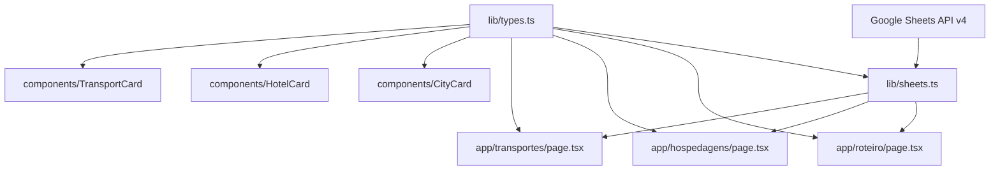
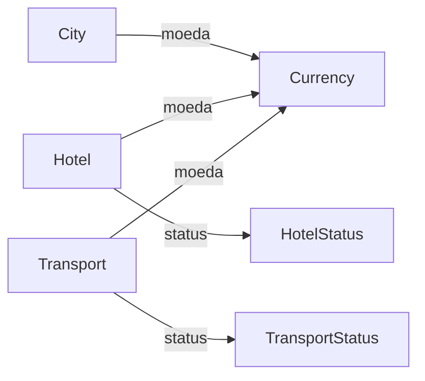

# Documento de Design Técnico — typescript-types

## Visão Geral

Este feature entrega `lib/types.ts` — o módulo central de tipos TypeScript do aplicativo companion de viagem Irlanda & UK. Ele modela os dados das três abas da planilha Google Sheets (`Roteiro`, `Hospedagens`, `Transportes`) como interfaces fortemente tipadas consumidas por todas as páginas e componentes da aplicação Next.js 14.

Os consumidores são os desenvolvedores do sistema: `lib/sheets.ts` (camada de parse) e todos os `page.tsx` e componentes que recebem dados tipados como props. O módulo não executa nenhum código em runtime — é um artefato de tempo de compilação puro.

**Impacto**: Introduz `lib/types.ts` como módulo folha sem alterar nenhum arquivo existente. Todos os outros módulos passarão a importar daqui como única fonte de verdade para os tipos de domínio.

### Objetivos

- Definir `City`, `Hotel` e `Transport` como interfaces `readonly` fortemente tipadas, cobrindo exatamente os campos das abas da planilha.
- Definir `HotelStatus`, `TransportStatus` e `Currency` como type aliases de union literal, eliminando strings mágicas em todo o projeto.
- Garantir que `lib/types.ts` compile sem erros em TypeScript strict mode e seja um módulo folha com zero importações internas.
- Servir como contrato de dados entre `lib/sheets.ts` (produtor) e páginas/componentes (consumidores).

### Não-Objetivos

- Validação de runtime dos dados recebidos da API — responsabilidade exclusiva de `lib/sheets.ts`.
- Formatação de datas para exibição (`DD/MM`) — responsabilidade exclusiva dos componentes de apresentação (`CityCard`, `HotelCard`, `TransportCard`).
- Qualquer lógica de negócio, utilitários ou chamadas de API dentro de `lib/types.ts`.
- Suporte a campos adicionais além dos definidos nos requisitos atuais.

---

## Requisitos × Design

| Requisito | Resumo | Componente | Interface | Fluxo |
|-----------|--------|------------|-----------|-------|
| 1.1–1.5 | Interface `City` com campos `readonly` | `lib/types.ts` | `City` | — |
| 2.1–2.5 | Interface `Hotel` com campos opcionais e `readonly` | `lib/types.ts` | `Hotel` | — |
| 3.1–3.5 | Interface `Transport` com campo opcional e `readonly` | `lib/types.ts` | `Transport` | — |
| 4.1–4.7 | Union literals `HotelStatus`, `TransportStatus`, `Currency` | `lib/types.ts` | Tipos auxiliares | — |
| 5.1–5.5 | Módulo folha: named exports, sem `any`, sem imports internos | `lib/types.ts` | Todos | — |
| 6.1–6.6 | Contrato de tipos number/string entre sheets.ts e os tipos | `lib/types.ts` + `lib/sheets.ts` | `City`, `Hotel`, `Transport` | — |

---

## Arquitetura

### Padrão: Módulo Folha (Leaf Module)

`lib/types.ts` não importa nenhum outro módulo interno. É o único vértice de entrada no grafo de dependências para todos os tipos de domínio, impossibilitando dependências circulares por construção.



**Decisões-chave**:
- `lib/types.ts` é importado como `import type { City } from '@/lib/types'` — eliminado em tempo de compilação, zero impacto no bundle de runtime.
- Union literals são preferidos a `enum` para evitar emissão de código JavaScript e incompatibilidade com `isolatedModules: true` (Next.js 14/SWC).
- `readonly` inline em cada campo expressa imutabilidade na fonte, independentemente de como o consumidor declara a variável.

### Stack de Tecnologia

| Camada | Escolha / Versão | Papel | Notas |
|--------|------------------|-------|-------|
| Linguagem | TypeScript (strict mode) | Definição dos contratos de tipo | `noImplicitAny`, `strictNullChecks` ativos |
| Framework | Next.js 14 (App Router) | Consumidor dos tipos nas páginas server-side | `isolatedModules: true` — incompatível com `const enum` |
| Runtime | Node.js 18+ | Compilação e execução do Next.js | — |

---

## Componentes e Interfaces

### Sumário

| Componente | Camada | Intenção | Requisitos | Dependências-chave | Contrato |
|------------|--------|----------|------------|-------------------|---------|
| `lib/types.ts` | Data / Tipos | Módulo folha de todos os tipos de domínio | 1.1–6.6 | Nenhuma (folha) | State |

---

### Data / Tipos

#### `lib/types.ts`

| Campo | Detalhe |
|-------|---------|
| Intent | Único ponto de definição de todos os tipos de domínio da aplicação de viagem |
| Requisitos | 1.1, 1.2, 1.3, 1.4, 1.5, 2.1, 2.2, 2.3, 2.4, 2.5, 3.1, 3.2, 3.3, 3.4, 3.5, 4.1, 4.2, 4.3, 4.4, 4.5, 4.6, 4.7, 5.1, 5.2, 5.3, 5.4, 5.5, 6.1, 6.2, 6.3, 6.4, 6.5, 6.6 |

**Responsabilidades e Restrições**
- Define e exporta apenas: interfaces (`City`, `Hotel`, `Transport`) e type aliases (`HotelStatus`, `TransportStatus`, `Currency`).
- Não contém lógica executável, transformações, imports internos ou `any`.
- Todos os campos das interfaces são `readonly`; campos opcionais usam `?` (não `| undefined`).
- Compila sem erros em TypeScript strict mode com `isolatedModules: true`.

**Dependências**
- Inbound: `lib/sheets.ts` — constrói objetos `City`, `Hotel`, `Transport` a partir dos dados brutos da API (P0)
- Inbound: `app/*/page.tsx` — importa tipos para anotar props e variáveis (P0)
- Inbound: `components/*.tsx` — importa tipos para anotar props dos componentes (P0)
- Outbound: nenhuma
- External: nenhuma

**Contratos**: [x] State

##### Definição Completa dos Tipos

```typescript
// Tipos auxiliares — union literals (zero runtime, isolatedModules-safe)
export type HotelStatus = 'confirmado' | 'pendente';
export type TransportStatus = 'pago' | 'pendente';
export type Currency = 'EUR' | 'GBP' | 'BRL';

// Requisito 1: Dados da aba Roteiro
export interface City {
  readonly id: string;
  readonly cidade: string;
  readonly emoji: string;
  readonly data_entrada: string;
  readonly data_saida: string;
  readonly noites: number;
  readonly destaque: string;
  readonly bairro: string;
  readonly preco_noite: number;
  readonly moeda: Currency;
  readonly atividades: string;
}

// Requisito 2: Dados da aba Hospedagens
export interface Hotel {
  readonly id: string;
  readonly cidade: string;
  readonly nome_hotel: string;
  readonly data_checkin: string;
  readonly data_checkout: string;
  readonly noites: number;
  readonly preco_total: number;
  readonly moeda: Currency;
  readonly status: HotelStatus;
  readonly endereco: string;
  readonly link_booking?: string;
  readonly observacoes?: string;
}

// Requisito 3: Dados da aba Transportes
export interface Transport {
  readonly id: string;
  readonly tipo: string;
  readonly emoji: string;
  readonly origem: string;
  readonly destino: string;
  readonly data: string;
  readonly horario: string;
  readonly duracao: string;
  readonly operadora: string;
  readonly status: TransportStatus;
  readonly preco: number;
  readonly moeda: Currency;
  readonly observacoes?: string;
}
```

**Notas de Implementação**
- **Imutabilidade**: `readonly` em todos os campos aplica o contrato na fonte. Consumidores que tentarem reatribuir campos recebem erro de compilação (5.4, 1.4, 2.4, 3.4).
- **Campos opcionais**: `link_booking?` e `observacoes?` permitem que `lib/sheets.ts` omita os campos quando as células estão vazias, sem passar `undefined` explicitamente (2.2, 3.2).
- **`id` estável**: `lib/sheets.ts` é responsável por gerar o `id` combinando índice de linha + nome da cidade (ex.: `"0-dublin"`), garantindo chaves React estáveis mesmo com cidades repetidas (1.2).
- **Risco**: Expansão futura de colunas na planilha exigirá atualização coordenada de `lib/types.ts` e `lib/sheets.ts`. O compilador sinalizará a descrepância imediatamente por conta dos campos `readonly` obrigatórios.

---

## Modelo de Dados

### Modelo de Domínio

Os três agregados são **value objects imutáveis** — não possuem identidade mutável nem ciclo de vida; existem apenas como snapshots dos dados da planilha no momento do parse.



**Invariantes**:
- `moeda` de qualquer entidade deve ser um dos três valores de `Currency`; o compilador rejeita qualquer outro valor em tempo de compilação, mas a planilha pode conter strings arbitrárias em runtime.
- `status` de `Hotel` e `Transport` é restrito aos respectivos union literals; strings arbitrárias são erro de compilação.
- Nenhum campo `number` aceita `string`; `lib/sheets.ts` deve converter antes de construir os objetos (6.2, 6.3, 6.4).

**Estratégia de Fallback para Dados Inválidos da Planilha** (responsabilidade de `lib/sheets.ts`):

| Campo | Valor inválido | Comportamento esperado |
|-------|---------------|----------------------|
| `moeda` | Qualquer string fora de `Currency` (ex.: `"USD"`, célula vazia) | Assumir `'EUR'` como padrão e registrar aviso no log do servidor |
| `status` (Hotel) | Qualquer string fora de `HotelStatus` | Assumir `'pendente'` como padrão e registrar aviso |
| `status` (Transport) | Qualquer string fora de `TransportStatus` | Assumir `'pendente'` como padrão e registrar aviso |
| `data_*` / `data` | String não parseável como data ISO | Preservar o valor bruto da célula e registrar aviso — não lançar exceção; a UI exibirá o valor como recebido |
| Campos `number` | String não numérica ou célula vazia | `parseFloat` retorna `NaN`; `lib/sheets.ts` deve substituir por `0` e registrar aviso |

O TypeScript não pode proteger valores de runtime provenientes de uma API externa; a barreira de validação deve ser implementada explicitamente em `lib/sheets.ts` antes de construir os objetos tipados.

### Contrato de Dados com `lib/sheets.ts`

| Campo | Tipo no `lib/types.ts` | Responsabilidade do `lib/sheets.ts` |
|-------|----------------------|--------------------------------------|
| `data_entrada`, `data_saida`, `data_checkin`, `data_checkout`, `data` | `string` | Normalizar para formato ISO `YYYY-MM-DD` (ex.: `"2026-08-15"`); formatação `DD/MM` é responsabilidade dos componentes de apresentação |
| `horario` | `string` | Preservar o valor textual da célula (ex.: `"14:35"`); sem normalização |
| `preco_noite`, `preco_total`, `preco` | `number` | Converter string da célula com `parseFloat` / `Number()` |
| `noites` (`City` e `Hotel`) | `number` | Converter string da célula com `parseInt` |
| `link_booking`, `observacoes` | `string?` | Omitir o campo quando a célula estiver vazia |
| `id` | `string` | Gerar como `${rowIndex}-${cidade.toLowerCase().replace(/\s+/g, '-')}` |

---

## Tratamento de Erros

`lib/types.ts` não executa código em runtime, portanto não gera erros de runtime. O tratamento de erros é inteiramente em tempo de compilação:

- **Campo obrigatório ausente**: erro de compilação TS2741 (`Property 'X' is missing`).
- **Tipo inválido em campo `number`**: erro TS2322 (`Type 'string' is not assignable to type 'number'`).
- **Valor inválido em union literal**: erro TS2322 (`Type '"invalido"' is not assignable to type 'HotelStatus'`).
- **Mutação de campo `readonly`**: erro TS2540 (`Cannot assign to 'X' because it is a read-only property`).

Não há necessidade de monitoramento ou logging para este módulo.

---

## Estratégia de Testes

### Testes de Unidade (TypeScript / tsc)

1. **Compilação limpa**: `tsc --noEmit` deve concluir sem erros ou avisos.
5. **Import sem erros**: `import type { City, Hotel, Transport, HotelStatus, TransportStatus, Currency } from '@/lib/types'` deve resolver sem erros em strict mode.

### Testes de Asserção de Tipo (erros negativos)

Testes que verificam se o TypeScript **rejeita** código inválido não podem usar `tsc --noEmit` diretamente — um erro de compilação quebraria o build. A ferramenta recomendada é **[`tsd`](https://github.com/SamVerschueren/tsd)** (ou **Vitest Type Testing** com `expectTypeOf`), que permite asserções do tipo "este código deve produzir um erro de tipo":

2. **Campo obrigatório ausente**: construir `City` sem `noites` deve produzir TS2741 — verificado com `// @ts-expect-error` + `tsd` ou `expectTypeOf`.
3. **Valor inválido em union**: `const s: HotelStatus = 'cancelado'` deve produzir TS2322.
4. **Mutação proibida**: `city.cidade = 'x'` deve produzir TS2540.

### Testes de Integração

1. **Compatibilidade com `lib/sheets.ts`**: funções de parse que retornam `City[]`, `Hotel[]`, `Transport[]` devem tipar corretamente sem casting.
2. **Props dos componentes**: `CityCard`, `HotelCard`, `TransportCard` recebendo objetos tipados devem compilar sem erros.
